# SMFS Catalog codebase architecture

> Generated from executable Python syntax. Comments and docstrings are not used as evidence. Function roles are name/structure classifications; direct dependencies come from call expressions.

## Confirmed top-level flow

```mermaid
flowchart LR
  RAW[IBW files / L1] --> SCAN[scanner + curve_loader qualification]
  SCAN --> CAT[(SQLite catalog)]
  CAT --> QUEUE[dashboard queue]
  QUEUE --> WORKER[analysis_worker]
  WORKER --> ANA[curve_analysis]
  ANA --> SIG[signal_processing]
  SIG --> DET[roi_detection]
  DET --> EVENTS[roi_events + roi_assembly]
  EVENTS --> L2[(analysis_results + event_map / L2)]
  L2 --> EXP[event summary + variables + criteria]
  EXP --> PCA[PCA + k-means]
  PCA -->|global clustering registry| EXP
  EXP --> FIT[distribution/GMM/WLC/2DH products]
  FIT --> EXPORT[manifested exports / L3-L4 work products]
  CAT -->|open/requeue| QUEUE
  EXP -->|reveal raw/ROI| QUEUE
```



The straight path exists, but persistence is shared rather than layered: `db.py` is used by ingest, analysis, exploration, fitting, and export-adjacent code. Reentry is mostly path/file-ID based through the dashboard and navigator. The PCA/k-means return edge is an in-memory publish/subscribe registry in `clustering.py`, consumed by exploration windows.

## Organization by responsibility

### Entry and orchestration

`analysis_worker.py`, `dashboard_window.py`, `navigator_bar.py`, `run_dashboard.py`, `widgets.py`

### Ingest and catalog persistence

`add_data_dialog.py`, `bulk_metadata_dialog.py`, `db.py`, `remove_files_dialog.py`, `scanner.py`

### L1 loading and qualification

`curve_loader.py`

### L1 to L2 signal/event pipeline

`curve_analysis.py`, `roi_assembly.py`, `roi_detection.py`, `roi_events.py`, `roi_pipeline.py`, `signal_processing.py`

### L2 exploration and gating

`categorical_window.py`, `clustering.py`, `criteria_dialog.py`, `criteria_gate.py`, `event_summary_window.py`, `pca_window.py`, `scatter_window.py`, `variable_window.py`, `variables.py`

### L3/L4 models, fits, and products

`base_2dh_window.py`, `dist_fit_core.py`, `dist_fit_window.py`, `event_processor.py`, `export_utils.py`, `gmm_fit_core.py`, `gmm_fit_window.py`, `histogram_binning.py`, `isoforce_window.py`, `ledger.py`, `mean_curve_window.py`, `models.py`, `normalized_2dh_window.py`, `physical_2dh_window.py`, `regression.py`, `wlc_view_window.py`

### Inspection and diagnostics UI

`class_lineplot_window.py`, `decomposition_window.py`, `display_roi.py`, `fft_window.py`, `rawcurve_window.py`, `trace_overlay_panel.py`

### Cross-cutting infrastructure

`__init__.py`, `bandwidth_warning.py`, `crashlog.py`, `date_picker_dialog.py`, `qt_utils.py`, `quantities.py`, `sample_marks.py`, `scope.py`, `style.py`

### Unclassified

`analysis_params.py`, `provenance.py`, `repoint_dialog.py`, `roi_selection.py`

## Static module dependency graph

```mermaid
graph TD
  run_dashboard --> crashlog
  run_dashboard --> db
  run_dashboard --> sample_marks
  add_data_dialog --> db
  add_data_dialog --> qt_utils
  add_data_dialog --> scanner
  add_data_dialog --> style
  analysis_worker --> curve_analysis
  analysis_worker --> db
  bandwidth_warning --> signal_processing
  base_2dh_window --> curve_loader
  base_2dh_window --> db
  base_2dh_window --> export_utils
  base_2dh_window --> ledger
  base_2dh_window --> pca_window
  base_2dh_window --> qt_utils
  base_2dh_window --> quantities
  base_2dh_window --> roi_events
  base_2dh_window --> roi_pipeline
  base_2dh_window --> style
  base_2dh_window --> trace_overlay_panel
  bulk_metadata_dialog --> db
  bulk_metadata_dialog --> qt_utils
  bulk_metadata_dialog --> style
  categorical_window --> db
  categorical_window --> export_utils
  categorical_window --> qt_utils
  categorical_window --> style
  categorical_window --> variable_window
  class_lineplot_window --> curve_loader
  class_lineplot_window --> db
  class_lineplot_window --> export_utils
  class_lineplot_window --> navigator_bar
  class_lineplot_window --> qt_utils
  class_lineplot_window --> quantities
  class_lineplot_window --> sample_marks
  class_lineplot_window --> style
  class_lineplot_window --> widgets
  criteria_dialog --> criteria_gate
  criteria_dialog --> db
  criteria_dialog --> qt_utils
  criteria_dialog --> quantities
  criteria_dialog --> style
  criteria_dialog --> variable_window
  criteria_dialog --> variables
  criteria_gate --> db
  criteria_gate --> variables
  curve_analysis --> analysis_params
  curve_analysis --> curve_loader
  curve_analysis --> db
  curve_analysis --> provenance
  curve_analysis --> roi_detection
  curve_analysis --> roi_events
  curve_analysis --> roi_pipeline
  curve_analysis --> signal_processing
  curve_loader --> db
  dashboard_window --> add_data_dialog
  dashboard_window --> analysis_worker
  dashboard_window --> bandwidth_warning
  dashboard_window --> bulk_metadata_dialog
  dashboard_window --> categorical_window
  dashboard_window --> class_lineplot_window
  dashboard_window --> criteria_dialog
  dashboard_window --> criteria_gate
  dashboard_window --> curve_analysis
  dashboard_window --> date_picker_dialog
  dashboard_window --> db
  dashboard_window --> event_summary_window
  dashboard_window --> export_utils
  dashboard_window --> navigator_bar
  dashboard_window --> qt_utils
  dashboard_window --> quantities
  dashboard_window --> rawcurve_window
  dashboard_window --> remove_files_dialog
  dashboard_window --> repoint_dialog
  dashboard_window --> roi_pipeline
  dashboard_window --> scanner
  dashboard_window --> scatter_window
  dashboard_window --> scope
  dashboard_window --> signal_processing
  dashboard_window --> style
  dashboard_window --> variable_window
  dashboard_window --> variables
  dashboard_window --> widgets
  date_picker_dialog --> db
  date_picker_dialog --> qt_utils
  date_picker_dialog --> style
  db --> analysis_params
  db --> criteria_gate
  db --> event_processor
  db --> roi_pipeline
  decomposition_window --> bandwidth_warning
  decomposition_window --> curve_analysis
  decomposition_window --> curve_loader
  decomposition_window --> db
  decomposition_window --> navigator_bar
  decomposition_window --> provenance
  decomposition_window --> qt_utils
  decomposition_window --> quantities
  decomposition_window --> sample_marks
  decomposition_window --> signal_processing
  decomposition_window --> style
  decomposition_window --> widgets
  display_roi --> curve_loader
  display_roi --> db
  display_roi --> models
  display_roi --> navigator_bar
  display_roi --> provenance
  display_roi --> qt_utils
  display_roi --> quantities
  display_roi --> roi_pipeline
  display_roi --> sample_marks
  display_roi --> style
  display_roi --> widgets
  dist_fit_window --> db
  dist_fit_window --> dist_fit_core
  dist_fit_window --> export_utils
  dist_fit_window --> histogram_binning
  dist_fit_window --> qt_utils
  dist_fit_window --> quantities
  dist_fit_window --> style
  event_processor --> models
  event_summary_window --> clustering
  event_summary_window --> criteria_gate
  event_summary_window --> db
  event_summary_window --> dist_fit_window
  event_summary_window --> export_utils
  event_summary_window --> gmm_fit_window
  event_summary_window --> histogram_binning
  event_summary_window --> isoforce_window
  event_summary_window --> ledger
  event_summary_window --> normalized_2dh_window
  event_summary_window --> physical_2dh_window
  event_summary_window --> qt_utils
  event_summary_window --> quantities
  event_summary_window --> roi_pipeline
  event_summary_window --> style
  event_summary_window --> widgets
  event_summary_window --> wlc_view_window
  export_utils --> db
  export_utils --> provenance
  export_utils --> quantities
  fft_window --> curve_loader
  fft_window --> qt_utils
  fft_window --> quantities
  fft_window --> sample_marks
  fft_window --> style
  fft_window --> widgets
  gmm_fit_core --> style
  gmm_fit_window --> db
  gmm_fit_window --> export_utils
  gmm_fit_window --> gmm_fit_core
  gmm_fit_window --> qt_utils
  gmm_fit_window --> quantities
  gmm_fit_window --> style
  isoforce_window --> curve_loader
  isoforce_window --> db
  isoforce_window --> export_utils
  isoforce_window --> navigator_bar
  isoforce_window --> provenance
  isoforce_window --> qt_utils
  isoforce_window --> quantities
  isoforce_window --> roi_pipeline
  isoforce_window --> sample_marks
  isoforce_window --> style
  isoforce_window --> widgets
  mean_curve_window --> dist_fit_core
  mean_curve_window --> export_utils
  mean_curve_window --> models
  mean_curve_window --> qt_utils
  mean_curve_window --> quantities
  mean_curve_window --> style
  mean_curve_window --> trace_overlay_panel
  navigator_bar --> db
  navigator_bar --> style
  normalized_2dh_window --> base_2dh_window
  normalized_2dh_window --> event_processor
  normalized_2dh_window --> models
  normalized_2dh_window --> style
  pca_window --> clustering
  pca_window --> export_utils
  pca_window --> mean_curve_window
  pca_window --> qt_utils
  pca_window --> quantities
  pca_window --> style
  physical_2dh_window --> base_2dh_window
  physical_2dh_window --> event_processor
  physical_2dh_window --> mean_curve_window
  physical_2dh_window --> quantities
  physical_2dh_window --> style
  qt_utils --> quantities
  qt_utils --> style
  rawcurve_window --> curve_analysis
  rawcurve_window --> curve_loader
  rawcurve_window --> db
  rawcurve_window --> decomposition_window
  rawcurve_window --> display_roi
  rawcurve_window --> fft_window
  rawcurve_window --> navigator_bar
  rawcurve_window --> provenance
  rawcurve_window --> qt_utils
  rawcurve_window --> quantities
  rawcurve_window --> roi_events
  rawcurve_window --> roi_pipeline
  rawcurve_window --> sample_marks
  rawcurve_window --> style
  rawcurve_window --> widgets
  remove_files_dialog --> db
  remove_files_dialog --> qt_utils
  remove_files_dialog --> style
  repoint_dialog --> db
  repoint_dialog --> qt_utils
  repoint_dialog --> style
  roi_assembly --> roi_events
  roi_events --> models
  roi_events --> roi_detection
  roi_pipeline --> analysis_params
  roi_pipeline --> curve_analysis
  roi_pipeline --> curve_loader
  roi_pipeline --> db
  roi_pipeline --> provenance
  roi_pipeline --> roi_assembly
  roi_pipeline --> roi_detection
  roi_pipeline --> roi_events
  roi_pipeline --> roi_selection
  roi_pipeline --> signal_processing
  roi_selection --> db
  sample_marks --> db
  sample_marks --> style
  scanner --> curve_loader
  scanner --> db
  scatter_window --> clustering
  scatter_window --> db
  scatter_window --> export_utils
  scatter_window --> qt_utils
  scatter_window --> quantities
  scatter_window --> regression
  scatter_window --> style
  scatter_window --> variables
  scatter_window --> widgets
  trace_overlay_panel --> style
  variable_window --> clustering
  variable_window --> db
  variable_window --> dist_fit_window
  variable_window --> export_utils
  variable_window --> histogram_binning
  variable_window --> qt_utils
  variable_window --> quantities
  variable_window --> regression
  variable_window --> roi_pipeline
  variable_window --> style
  variable_window --> variables
  variable_window --> widgets
  variables --> db
  variables --> quantities
  variables --> roi_pipeline
  widgets --> clustering
  widgets --> sample_marks
  widgets --> style
  wlc_view_window --> clustering
  wlc_view_window --> curve_loader
  wlc_view_window --> db
  wlc_view_window --> export_utils
  wlc_view_window --> models
  wlc_view_window --> navigator_bar
  wlc_view_window --> provenance
  wlc_view_window --> qt_utils
  wlc_view_window --> quantities
  wlc_view_window --> roi_pipeline
  wlc_view_window --> sample_marks
  wlc_view_window --> style
  wlc_view_window --> widgets
```

## Module and callable inventory

Line ranges refer to the current source. `Direct app calls` lists statically visible calls into major app services; an empty cell does not mean the callable has no effect.

### `run_dashboard.py` (183 lines)

Imports app modules: `crashlog`, `db`, `sample_marks`. Top-level classes: none.

| Callable | Lines | Structural role | Direct app calls |
|---|---:|---|---|
| `_frozen` | 52–54 | helper/control flow | — |
| `resource_path` | 57–69 | helper/control flow | — |
| `_stop_xpra_session` | 72–107 | helper/control flow | — |
| `_ensure_display` | 110–152 | helper/control flow | — |
| `main` | 155–178 | helper/control flow | `_db.check_db_machine`, `_db.initialise` |

### `__init__.py` (17 lines)

Imports app modules: none. Top-level classes: none.

| Callable | Lines | Structural role | Direct app calls |
|---|---:|---|---|
| *(no callables)* | — | package metadata/constants | — |

### `add_data_dialog.py` (265 lines)

Imports app modules: `db`, `qt_utils`, `scanner`, `style`. Top-level classes: `_ScanProgress`, `AddDataDialog`.

| Callable | Lines | Structural role | Direct app calls |
|---|---:|---|---|
| `_ScanProgress.__init__` | 46–52 | construction/wiring | — |
| `_ScanProgress._drop_cursor` | 54–57 | helper/control flow | — |
| `_ScanProgress.__call__` | 59–65 | helper/control flow | — |
| `_ScanProgress.close` | 67–71 | helper/control flow | — |
| `AddDataDialog.__init__` | 80–86 | construction/wiring | — |
| `AddDataDialog._build_ui` | 88–137 | UI/view coordination | — |
| `AddDataDialog._on_browse` | 139–142 | UI/event handler | — |
| `AddDataDialog._confirm_no_overlap` | 144–168 | helper/control flow | `_db.find_overlapping_directories` |
| `AddDataDialog._on_accept` | 170–215 | UI/event handler | `_db.list_files`, `_scanner.scan_directory` |
| `AddDataDialog._accept_parent_tree` | 217–265 | helper/control flow | `_scanner.scan_tree` |

### `analysis_params.py` (90 lines)

Imports app modules: none. Top-level classes: `AnalysisParams`.

| Callable | Lines | Structural role | Direct app calls |
|---|---:|---|---|
| `AnalysisParams.from_mapping` | 36–60 | helper/control flow | — |
| `AnalysisParams.as_dict` | 62–63 | helper/control flow | — |
| `AnalysisParams.with_update` | 65–68 | helper/control flow | — |
| `AnalysisParams.revision` | 71–73 | helper/control flow | — |
| `AnalysisParams.__getitem__` | 77–80 | helper/control flow | — |
| `AnalysisParams.__iter__` | 82–83 | helper/control flow | — |
| `AnalysisParams.__len__` | 85–86 | helper/control flow | — |

### `analysis_worker.py` (508 lines)

Imports app modules: `curve_analysis`, `db`. Top-level classes: `AnalysisWorker`.

| Callable | Lines | Structural role | Direct app calls |
|---|---:|---|---|
| `AnalysisWorker.__init__` | 93–117 | construction/wiring | — |
| `AnalysisWorker.stop` | 121–126 | helper/control flow | — |
| `AnalysisWorker.set_paused` | 128–135 | state mutation | — |
| `AnalysisWorker.is_paused` | 137–139 | helper/control flow | — |
| `AnalysisWorker.throttle_ms` | 141–145 | helper/control flow | — |
| `AnalysisWorker.set_throttle_ms` | 147–160 | state mutation | — |
| `AnalysisWorker.direction` | 162–165 | helper/control flow | — |
| `AnalysisWorker.set_direction` | 167–174 | state mutation | — |
| `AnalysisWorker.step_to` | 176–183 | helper/control flow | — |
| `AnalysisWorker.step_relative` | 185–189 | helper/control flow | — |
| `AnalysisWorker.playhead` | 191–193 | helper/control flow | — |
| `AnalysisWorker.notify_work_available` | 195–203 | helper/control flow | — |
| `AnalysisWorker.queue_ids` | 205–214 | helper/control flow | — |
| `AnalysisWorker.invalidate_queue_cache` | 216–231 | helper/control flow | — |
| `AnalysisWorker.run` | 235–249 | helper/control flow | `_db.get_connection` |
| `AnalysisWorker._run_loop` | 251–327 | helper/control flow | — |
| `AnalysisWorker._process_one` | 331–396 | helper/control flow | `_db.set_event`, `_db.set_queue_status`, `analyse_and_classify` |
| `AnalysisWorker._fail` | 398–408 | helper/control flow | `_db.set_queue_status` |
| `AnalysisWorker._lookup_path` | 410–411 | helper/control flow | `_db.get_path` |
| `AnalysisWorker._check_stop` | 413–415 | helper/control flow | — |
| `AnalysisWorker._wait_while_paused` | 417–424 | helper/control flow | — |
| `AnalysisWorker._wait_for_work` | 426–431 | helper/control flow | — |
| `AnalysisWorker._wait_for_throttle` | 433–451 | helper/control flow | — |
| `AnalysisWorker._pop_step_request` | 453–457 | helper/control flow | — |
| `AnalysisWorker._is_paused_locked` | 459–461 | helper/control flow | — |
| `AnalysisWorker._set_paused_internal` | 463–468 | helper/control flow | — |
| `AnalysisWorker._queue_ids` | 472–489 | helper/control flow | `_db.list_queue` |
| `AnalysisWorker._neighbour_file_id` | 494–508 | helper/control flow | — |

### `bandwidth_warning.py` (31 lines)

Imports app modules: `signal_processing`. Top-level classes: none.

| Callable | Lines | Structural role | Direct app calls |
|---|---:|---|---|
| `filter_bandwidth_warning` | 16–31 | helper/control flow | — |

### `base_2dh_window.py` (1094 lines)

Imports app modules: `curve_loader`, `db`, `export_utils`, `ledger`, `pca_window`, `qt_utils`, `quantities`, `roi_events`, `roi_pipeline`, `style`, `trace_overlay_panel`. Top-level classes: `_GridDialog`, `_TwoDHWindowBase`.

| Callable | Lines | Structural role | Direct app calls |
|---|---:|---|---|
| `_counts_per_trace` | 68–73 | helper/control flow | — |
| `_GridDialog.__init__` | 101–163 | construction/wiring | — |
| `_GridDialog._x_bins_label` | 167–168 | helper/control flow | — |
| `_GridDialog._f_bins_label` | 170–171 | helper/control flow | — |
| `_GridDialog._range_spec` | 173–178 | helper/control flow | — |
| `_GridDialog._make_range_spins` | 180–190 | helper/control flow | — |
| `_GridDialog._x_range_label` | 200–201 | helper/control flow | — |
| `_GridDialog._f_range_label` | 203–204 | helper/control flow | — |
| `_GridDialog._add_extra_rows` | 206–207 | helper/control flow | — |
| `_GridDialog._reset` | 209–215 | helper/control flow | — |
| `_GridDialog.values` | 218–227 | helper/control flow | — |
| `_TwoDHWindowBase.__init__` | 247–389 | construction/wiring | — |
| `_TwoDHWindowBase._profile_key` | 394–397 | helper/control flow | — |
| `_TwoDHWindowBase._load_grid_params` | 399–419 | UI/view coordination | `_db.get_experimentalist_profile` |
| `_TwoDHWindowBase._save_grid_params` | 421–426 | helper/control flow | `_db.merge_experimentalist_profile` |
| `_TwoDHWindowBase._profile_spec` | 428–432 | helper/control flow | — |
| `_TwoDHWindowBase._build_lut` | 436–437 | UI/view coordination | — |
| `_TwoDHWindowBase._apply_z_scale` | 439–443 | helper/control flow | — |
| `_TwoDHWindowBase._draw` | 445–454 | UI/view coordination | — |
| `_TwoDHWindowBase._on_z_slider` | 456–460 | UI/event handler | — |
| `_TwoDHWindowBase._on_z_auto` | 462–463 | UI/event handler | — |
| `_TwoDHWindowBase._build_extra_controls` | 467–468 | UI/view coordination | — |
| `_TwoDHWindowBase._on_grid_settings` | 470–486 | UI/event handler | — |
| `_TwoDHWindowBase._make_grid_dialog` | 488–489 | helper/control flow | — |
| `_TwoDHWindowBase._apply_extra_dialog_values` | 491–492 | helper/control flow | — |
| `_TwoDHWindowBase._apply_axis_labels` | 494–506 | helper/control flow | — |
| `_TwoDHWindowBase._provenance_caption` | 523–537 | helper/control flow | — |
| `_TwoDHWindowBase._provenance_extra` | 539–540 | helper/control flow | — |
| `_TwoDHWindowBase._refresh_provenance_caption` | 542–543 | UI/view coordination | — |
| `_TwoDHWindowBase.export_provenance` | 545–569 | helper/control flow | — |
| `_TwoDHWindowBase._export_provenance_extra` | 571–572 | helper/control flow | — |
| `_TwoDHWindowBase._after_grid_settings_applied` | 574–575 | helper/control flow | — |
| `_TwoDHWindowBase._on_rebuild` | 577–582 | UI/event handler | — |
| `_TwoDHWindowBase.add_event` | 586–596 | state mutation | — |
| `_TwoDHWindowBase.sync_from_event_summary` | 600–693 | helper/control flow | `_db.get_connection`, `_db.get_derived_results_bulk_latest`, `_db.get_event_histogram`, `_db.get_file_id`, `_db.normalize_path` |
| `_TwoDHWindowBase._load_or_compute` | 697–707 | UI/view coordination | `_db.get_event_histogram`, `_db.get_file_id`, `_db.write_event_histogram` |
| `_TwoDHWindowBase._full_xF` | 711–736 | helper/control flow | `_db.get_derived_results_bulk_latest`, `_db.normalize_path` |
| `_TwoDHWindowBase._resolve_fit` | 738–753 | helper/control flow | — |
| `_TwoDHWindowBase._stored_roi_span` | 755–778 | helper/control flow | `_db.get_file_id`, `_db.get_latest_event_map` |
| `_TwoDHWindowBase._stored_segment_fit` | 780–825 | helper/control flow | `_db.get_file_id`, `_db.get_latest_event_map`, `_db.get_latest_event_map_params`, `_db.get_segment_override` |
| `_TwoDHWindowBase._compute_from_curve` | 827–842 | helper/control flow | — |
| `_TwoDHWindowBase._build_histogram` | 844–846 | UI/view coordination | — |
| `_TwoDHWindowBase._requires_wlc_fit` | 848–861 | helper/control flow | — |
| `_TwoDHWindowBase._refresh` | 865–889 | UI/view coordination | — |
| `_TwoDHWindowBase._on_refresh_extra` | 891–892 | UI/event handler | — |
| `_TwoDHWindowBase._on_export_2dh` | 896–931 | UI/event handler | — |
| `_TwoDHWindowBase._after_plot_setup` | 933–934 | helper/control flow | — |
| `_TwoDHWindowBase._overlay_xF` | 938–949 | helper/control flow | — |
| `_TwoDHWindowBase._build_overlay_xF` | 951–954 | UI/view coordination | — |
| `_TwoDHWindowBase._on_selection_toggled` | 964–978 | UI/event handler | — |
| `_TwoDHWindowBase._run_pca` | 982–990 | helper/control flow | — |
| `_TwoDHWindowBase._run_pca_impl` | 992–1084 | helper/control flow | — |
| `_TwoDHWindowBase._axis_labels` | 1086–1094 | helper/control flow | — |

### `bulk_metadata_dialog.py` (177 lines)

Imports app modules: `db`, `qt_utils`, `style`. Top-level classes: `BulkMetadataDialog`.

| Callable | Lines | Structural role | Direct app calls |
|---|---:|---|---|
| `BulkMetadataDialog.__init__` | 57–66 | construction/wiring | — |
| `BulkMetadataDialog._build_ui` | 68–104 | UI/view coordination | — |
| `BulkMetadataDialog._make_value_box` | 106–143 | helper/control flow | `_db.get_distinct_values` |
| `BulkMetadataDialog._wrap` | 145–149 | helper/control flow | — |
| `BulkMetadataDialog._on_accept` | 151–177 | UI/event handler | `_db.set_file_descriptors_bulk` |

### `categorical_window.py` (332 lines)

Imports app modules: `db`, `export_utils`, `qt_utils`, `style`, `variable_window`. Top-level classes: `CategoricalStatsWindow`.

| Callable | Lines | Structural role | Direct app calls |
|---|---:|---|---|
| `_jitter` | 67–69 | helper/control flow | — |
| `CategoricalStatsWindow.__init__` | 79–174 | construction/wiring | — |
| `CategoricalStatsWindow._colour` | 178–186 | helper/control flow | — |
| `CategoricalStatsWindow._load` | 190–254 | UI/view coordination | `_db.get_measured_datetimes`, `_db.normalize_path` |
| `CategoricalStatsWindow.export_provenance` | 258–266 | helper/control flow | — |
| `CategoricalStatsWindow._on_export` | 268–291 | UI/event handler | — |
| `CategoricalStatsWindow._populate_list` | 295–303 | UI/view coordination | — |
| `CategoricalStatsWindow._select` | 305–314 | helper/control flow | — |
| `CategoricalStatsWindow._on_scatter_clicked` | 316–325 | UI/event handler | — |
| `CategoricalStatsWindow._on_list_row_changed` | 327–328 | UI/event handler | — |
| `CategoricalStatsWindow._on_double_click` | 330–332 | UI/event handler | — |

### `class_lineplot_window.py` (410 lines)

Imports app modules: `curve_loader`, `db`, `export_utils`, `navigator_bar`, `qt_utils`, `quantities`, `sample_marks`, `style`, `widgets`. Top-level classes: `ClassLinePlotWindow`.

| Callable | Lines | Structural role | Direct app calls |
|---|---:|---|---|
| `ClassLinePlotWindow.__init__` | 73–160 | construction/wiring | — |
| `ClassLinePlotWindow._build_nav_row` | 164–217 | UI/view coordination | — |
| `ClassLinePlotWindow.export_provenance` | 221–228 | helper/control flow | — |
| `ClassLinePlotWindow._on_export` | 230–251 | UI/event handler | — |
| `ClassLinePlotWindow.refresh` | 257–259 | helper/control flow | — |
| `ClassLinePlotWindow._populate` | 261–305 | UI/view coordination | `_db.list_queue` |
| `ClassLinePlotWindow._go_prev` | 309–313 | helper/control flow | — |
| `ClassLinePlotWindow._go_next` | 315–319 | helper/control flow | — |
| `ClassLinePlotWindow._on_row_changed` | 321–327 | UI/event handler | — |
| `ClassLinePlotWindow._toggle_auto` | 329–338 | helper/control flow | — |
| `ClassLinePlotWindow._stop_auto` | 340–343 | helper/control flow | — |
| `ClassLinePlotWindow._auto_step` | 345–357 | helper/control flow | — |
| `ClassLinePlotWindow._on_speed_change` | 359–362 | UI/event handler | — |
| `ClassLinePlotWindow._set_navigation_enabled` | 364–371 | helper/control flow | — |
| `ClassLinePlotWindow._show_current` | 375–401 | helper/control flow | — |
| `ClassLinePlotWindow._clear_plot` | 403–405 | helper/control flow | — |
| `ClassLinePlotWindow._on_double_click` | 407–410 | UI/event handler | — |

### `clustering.py` (261 lines)

Imports app modules: none. Top-level classes: `Clustering`.

| Callable | Lines | Structural role | Direct app calls |
|---|---:|---|---|
| `Clustering.n_labelled` | 66–67 | helper/control flow | — |
| `Clustering.label_for` | 69–70 | helper/control flow | — |
| `Clustering.describe` | 72–94 | helper/control flow | — |
| `first_pc_order` | 97–104 | helper/control flow | — |
| `order_by_first_pc` | 107–121 | helper/control flow | — |
| `current` | 133–134 | helper/control flow | — |
| `set_current` | 137–145 | state mutation | — |
| `clear` | 148–159 | helper/control flow | — |
| `subscribe` | 162–170 | helper/control flow | — |
| `unsubscribe` | 173–178 | helper/control flow | — |
| `_notify` | 181–188 | helper/control flow | — |
| `now_stamp` | 191–192 | helper/control flow | — |
| `coverage_text` | 195–206 | read/query/resolve | — |
| `labels_for_rows` | 209–221 | helper/control flow | — |
| `provenance` | 224–261 | helper/control flow | — |

### `crashlog.py` (206 lines)

Imports app modules: `__version__`. Top-level classes: none.

| Callable | Lines | Structural role | Direct app calls |
|---|---:|---|---|
| `log_path` | 86–88 | helper/control flow | — |
| `_timestamp` | 91–92 | helper/control flow | — |
| `_rotate` | 95–109 | helper/control flow | — |
| `_write` | 112–125 | helper/control flow | — |
| `_excepthook` | 128–136 | helper/control flow | — |
| `_thread_excepthook` | 139–147 | helper/control flow | — |
| `install` | 150–182 | helper/control flow | — |
| `connect_clean_exit` | 185–192 | helper/control flow | — |
| `mark_clean_exit` | 195–206 | state mutation | — |

### `criteria_dialog.py` (251 lines)

Imports app modules: `criteria_gate`, `db`, `qt_utils`, `quantities`, `style`, `variable_window`, `variables`. Top-level classes: `CriteriaDialog`.

| Callable | Lines | Structural role | Direct app calls |
|---|---:|---|---|
| `_bounds_text` | 39–57 | helper/control flow | — |
| `_criterion_tooltip` | 70–80 | helper/control flow | — |
| `CriteriaDialog.__init__` | 94–181 | construction/wiring | — |
| `CriteriaDialog._update_title` | 185–193 | UI/view coordination | — |
| `CriteriaDialog.set_event_paths` | 195–200 | state mutation | — |
| `CriteriaDialog.refresh` | 202–231 | helper/control flow | `_db.get_threshold` |
| `CriteriaDialog._on_toggle` | 235–238 | UI/event handler | — |
| `CriteriaDialog._edit_bounds` | 240–251 | helper/control flow | — |

### `criteria_gate.py` (169 lines)

Imports app modules: `db`, `variables`. Top-level classes: none.

| Callable | Lines | Structural role | Direct app calls |
|---|---:|---|---|
| `get_criteria` | 22–36 | read/query/resolve | `_db.get_experimentalist_profile` |
| `set_criterion` | 39–48 | state mutation | `_db.merge_experimentalist_profile` |
| `active_owner` | 51–53 | helper/control flow | `_db.active_param_owner` |
| `_bounds` | 56–64 | helper/control flow | `_db.get_thresholds` |
| `_active_gate` | 67–78 | helper/control flow | — |
| `get_active_criteria` | 81–88 | read/query/resolve | — |
| `_values` | 91–99 | helper/control flow | — |
| `_failures` | 102–126 | helper/control flow | `_db.normalize_path` |
| `has_criteria_checked` | 129–137 | helper/control flow | — |
| `evaluate` | 140–155 | helper/control flow | — |
| `explain` | 158–169 | helper/control flow | — |

### `curve_analysis.py` (781 lines)

Imports app modules: `analysis_params`, `curve_loader`, `db`, `provenance`, `roi_detection`, `roi_events`, `roi_pipeline`, `signal_processing`. Top-level classes: `CurveAnalysisError`, `_PipelineParams`, `Stage1Search`, `CurveResult`.

| Callable | Lines | Structural role | Direct app calls |
|---|---:|---|---|
| `CurveAnalysisError.__init__` | 50–53 | construction/wiring | — |
| `pipeline_params_from` | 78–147 | helper/control flow | — |
| `CurveResult.verdict` | 227–228 | helper/control flow | — |
| `analyse_curve` | 231–595 | computation/transformation | `_db.get_analysis_result`, `_db.get_analysis_results_multi`, `_db.write_analysis_result`, `_db.write_analysis_results_multi`, `compute_detection_signals` |
| `_get` | 279–283 | helper/control flow | `_db.get_analysis_result` |
| `_put` | 285–288 | helper/control flow | `_db.write_analysis_result` |
| `_get_multi` | 290–294 | helper/control flow | `_db.get_analysis_results_multi` |
| `_put_multi` | 296–299 | helper/control flow | `_db.write_analysis_results_multi` |
| `_non_event` | 310–320 | helper/control flow | — |
| `_stage1` | 340–356 | helper/control flow | — |
| `current_signature` | 598–617 | helper/control flow | `_db.load_analysis_params` |
| `analyse_and_classify` | 620–730 | computation/transformation | `_db.delete_event_map`, `_db.dequeue_files`, `_db.get_analysis_result`, `_db.load_analysis_params`, `_db.set_event`, `_db.set_unusable_reason`, `_db.write_analysis_result`, `analyse_and_classify`, `analyse_curve` |
| `_persist_multi_event_roi` | 735–779 | helper/control flow | `compute_curve_events_coords` |

### `curve_loader.py` (719 lines)

Imports app modules: `db`. Top-level classes: `LoadError`, `UnusableCurveError`, `TruncatedCurveError`, `Qualification`, `ForceCurve`, `RawTrace`.

| Callable | Lines | Structural role | Direct app calls |
|---|---:|---|---|
| `UnusableCurveError.__init__` | 60–62 | construction/wiring | — |
| `TruncatedCurveError.__init__` | 72–73 | construction/wiring | — |
| `channel_map` | 116–133 | helper/control flow | — |
| `piezo_column` | 136–144 | helper/control flow | — |
| `Qualification.usable` | 169–170 | helper/control flow | — |
| `_is_truncated` | 173–187 | helper/control flow | — |
| `_spring_constant` | 190–206 | helper/control flow | — |
| `_hold_z_sensor` | 209–218 | helper/control flow | — |
| `_modality` | 221–263 | helper/control flow | — |
| `qualify_wave` | 266–374 | helper/control flow | — |
| `_note_float` | 377–384 | helper/control flow | — |
| `_note_fields` | 387–433 | helper/control flow | — |
| `ForceCurve.force_appr` | 479–481 | helper/control flow | — |
| `ForceCurve.force_retr` | 484–486 | helper/control flow | — |
| `ForceCurve.filename` | 489–490 | helper/control flow | — |
| `RawTrace.filename` | 524–525 | helper/control flow | — |
| `RawTrace.force_pn` | 528–532 | helper/control flow | — |
| `load_raw_trace` | 535–597 | read/query/resolve | — |
| `load_force_curve` | 602–719 | read/query/resolve | — |

### `dashboard_window.py` (2077 lines)

Imports app modules: `add_data_dialog`, `analysis_worker`, `bandwidth_warning`, `bulk_metadata_dialog`, `categorical_window`, `class_lineplot_window`, `criteria_dialog`, `criteria_gate`, `curve_analysis`, `date_picker_dialog`, `db`, `event_summary_window`, `export_utils`, `navigator_bar`, `qt_utils`, `quantities`, `rawcurve_window`, `remove_files_dialog`, `repoint_dialog`, `roi_pipeline`, `scanner`, `scatter_window`, `scope`, `signal_processing`, `style`, `variable_window`, `variables`, `widgets`. Top-level classes: `FilesTableModel`, `DashboardWindow`.

| Callable | Lines | Structural role | Direct app calls |
|---|---:|---|---|
| `_vsep` | 55–60 | helper/control flow | — |
| `_row_get` | 63–68 | helper/control flow | — |
| `_bg_for` | 71–72 | helper/control flow | — |
| `_prettify_key` | 213–214 | helper/control flow | — |
| `FilesTableModel.__init__` | 220–225 | construction/wiring | — |
| `FilesTableModel.set_rows` | 227–234 | state mutation | — |
| `FilesTableModel.row_id` | 236–237 | helper/control flow | — |
| `FilesTableModel.row_path` | 239–240 | helper/control flow | — |
| `FilesTableModel.index_for_id` | 242–243 | helper/control flow | — |
| `FilesTableModel.value_for_id` | 245–248 | helper/control flow | — |
| `FilesTableModel.update_field` | 250–271 | helper/control flow | — |
| `FilesTableModel.rowCount` | 273–274 | helper/control flow | — |
| `FilesTableModel.columnCount` | 276–277 | helper/control flow | — |
| `FilesTableModel.headerData` | 279–284 | helper/control flow | — |
| `FilesTableModel.data` | 286–295 | helper/control flow | — |
| `FilesTableModel.sort` | 297–313 | helper/control flow | — |
| `FilesTableModel._k` | 303–309 | helper/control flow | — |
| `DashboardWindow.__init__` | 322–381 | construction/wiring | `_db.clear_analysis_queue` |
| `DashboardWindow._refresh_freshness` | 383–392 | UI/view coordination | — |
| `DashboardWindow.closeEvent` | 394–410 | UI/event handler | — |
| `DashboardWindow._confirm_queue_saved` | 412–442 | helper/control flow | `_db.queue_paths` |
| `DashboardWindow._build_ui` | 445–557 | UI/view coordination | — |
| `DashboardWindow._relayout_splitter` | 559–577 | helper/control flow | — |
| `DashboardWindow._build_scope_section` | 579–649 | UI/view coordination | — |
| `DashboardWindow._build_db_section` | 651–681 | UI/view coordination | — |
| `DashboardWindow._build_queue_section` | 683–811 | UI/view coordination | — |
| `DashboardWindow._build_gate_cluster` | 813–836 | UI/view coordination | — |
| `DashboardWindow._sync_gate_buttons` | 838–846 | helper/control flow | — |
| `DashboardWindow._on_export_classification_report` | 848–876 | UI/event handler | `_db.classification_report_rows` |
| `DashboardWindow._on_define_metadata` | 878–890 | UI/event handler | `_db.list_files` |
| `DashboardWindow._on_remove_files` | 892–905 | UI/event handler | `_db.list_files` |
| `DashboardWindow._on_recheck_catalog` | 907–971 | UI/event handler | `_db.duplicate_groups`, `_db.list_files`, `_scanner.requalify_catalog` |
| `DashboardWindow._on_save_queue` | 973–987 | UI/event handler | `_db.queue_paths` |
| `DashboardWindow._on_export_queue_table` | 989–1029 | UI/event handler | `_db.list_queue` |
| `DashboardWindow._on_load_queue` | 1031–1059 | UI/event handler | `_db.import_queue_from_paths` |
| `DashboardWindow._update_export_dir_label` | 1061–1077 | UI/view coordination | `_db.get_app_setting` |
| `DashboardWindow._on_set_export_folder` | 1079–1086 | UI/event handler | — |
| `DashboardWindow._refresh_facets` | 1089–1122 | UI/view coordination | `_db.get_facet_options` |
| `DashboardWindow._current_scope` | 1124–1138 | helper/control flow | — |
| `DashboardWindow._on_scope_edit` | 1140–1150 | UI/event handler | — |
| `DashboardWindow._prune_children` | 1152–1161 | helper/control flow | — |
| `DashboardWindow._clear_filters` | 1163–1172 | helper/control flow | — |
| `DashboardWindow._refresh_db_and_counts` | 1175–1189 | UI/view coordination | `_db.list_files` |
| `DashboardWindow._on_db_double_click` | 1191–1194 | UI/event handler | — |
| `DashboardWindow._on_queue_double_click` | 1196–1200 | UI/event handler | — |
| `DashboardWindow._selected_db_ids` | 1202–1209 | helper/control flow | — |
| `DashboardWindow._compute_queue_derived_cols` | 1212–1224 | helper/control flow | `_db.get_queue_analysis_types` |
| `DashboardWindow._fetch_queue_column_data` | 1226–1231 | helper/control flow | — |
| `DashboardWindow._queue_cell_value` | 1234–1236 | helper/control flow | `_db.normalize_path` |
| `DashboardWindow._queue_cell_text` | 1239–1242 | helper/control flow | — |
| `DashboardWindow._refresh_queue_table` | 1244–1305 | UI/view coordination | `_db.list_queue` |
| `DashboardWindow._selected_ids` | 1307–1315 | helper/control flow | — |
| `DashboardWindow._on_send_to_queue` | 1317–1324 | UI/event handler | `_db.enqueue_files` |
| `DashboardWindow._on_segment_select_changed` | 1326–1329 | UI/event handler | — |
| `DashboardWindow._on_remove_from_queue` | 1331–1337 | UI/event handler | `_db.dequeue_files` |
| `DashboardWindow._on_empty_queue` | 1339–1353 | UI/event handler | `_db.clear_analysis_queue` |
| `DashboardWindow._on_worker_paused_changed` | 1356–1357 | UI/event handler | — |
| `DashboardWindow._on_worker_playhead_changed` | 1359–1361 | UI/event handler | — |
| `DashboardWindow._on_worker_direction_changed` | 1363–1365 | UI/event handler | — |
| `DashboardWindow._on_worker_queue_empty` | 1367–1368 | UI/event handler | — |
| `DashboardWindow._compute_freshness` | 1370–1377 | helper/control flow | `_db.queue_freshness` |
| `DashboardWindow._status_class` | 1379–1385 | helper/control flow | — |
| `DashboardWindow._set_status_cell` | 1387–1412 | helper/control flow | — |
| `DashboardWindow._raw_status` | 1414–1418 | helper/control flow | — |
| `DashboardWindow._freshness_line` | 1420–1429 | helper/control flow | — |
| `DashboardWindow._current_rate` | 1431–1440 | helper/control flow | — |
| `DashboardWindow._mean_cost` | 1442–1445 | helper/control flow | — |
| `DashboardWindow._files_ahead` | 1447–1457 | helper/control flow | — |
| `DashboardWindow._eta_text` | 1459–1487 | helper/control flow | — |
| `DashboardWindow._update_location_label` | 1489–1516 | UI/view coordination | — |
| `DashboardWindow._acq_filter_line` | 1518–1536 | helper/control flow | `_db.load_analysis_params` |
| `DashboardWindow._update_gate_label` | 1538–1589 | UI/view coordination | `_db.active_param_owner`, `_db.list_queue` |
| `DashboardWindow._filename_for_playhead` | 1591–1601 | helper/control flow | — |
| `DashboardWindow._on_open_viewer` | 1603–1618 | UI/event handler | — |
| `DashboardWindow._open_raw_viewer` | 1620–1632 | helper/control flow | `_db.enqueue_files`, `_db.get_file_id` |
| `DashboardWindow.reveal_raw_at` | 1634–1636 | helper/control flow | — |
| `DashboardWindow.reveal_roi_at` | 1638–1645 | helper/control flow | — |
| `DashboardWindow._on_file_started` | 1648–1649 | UI/event handler | — |
| `DashboardWindow._on_file_done` | 1651–1652 | UI/event handler | — |
| `DashboardWindow._on_file_error` | 1654–1658 | UI/event handler | — |
| `DashboardWindow._on_data_unavailable` | 1660–1674 | UI/event handler | — |
| `DashboardWindow._on_worker_fatal_error` | 1676–1681 | UI/event handler | — |
| `DashboardWindow._flush_worker_events` | 1683–1772 | helper/control flow | — |
| `DashboardWindow._fmt_eta` | 1775–1783 | helper/control flow | — |
| `DashboardWindow._update_queue_row` | 1786–1803 | UI/view coordination | — |
| `DashboardWindow._on_pick_date` | 1806–1816 | UI/event handler | — |
| `DashboardWindow._on_add_data` | 1819–1823 | UI/event handler | — |
| `DashboardWindow._on_repoint_data` | 1826–1833 | UI/event handler | — |
| `DashboardWindow._spawn` | 1836–1841 | helper/control flow | — |
| `DashboardWindow._on_queue_header_clicked` | 1845–1898 | UI/event handler | `_db.list_queue` |
| `DashboardWindow._gate_hit_and_reasons` | 1900–1906 | helper/control flow | — |
| `DashboardWindow._set_hit_cell` | 1908–1918 | helper/control flow | — |
| `DashboardWindow._hit_tooltip` | 1920–1937 | helper/control flow | — |
| `DashboardWindow._hit_text` | 1940–1946 | helper/control flow | — |
| `DashboardWindow._count_non_hit` | 1948–1956 | helper/control flow | `_db.list_queue` |
| `DashboardWindow._refresh_hit_column` | 1958–1968 | UI/view coordination | `_db.list_queue` |
| `DashboardWindow._queue_event_paths` | 1970–1973 | helper/control flow | `_db.list_queue` |
| `DashboardWindow._open_event_summary` | 1975–1986 | helper/control flow | — |
| `DashboardWindow._open_scatter` | 1989–2006 | helper/control flow | — |
| `DashboardWindow._attach_raw` | 2008–2012 | helper/control flow | — |
| `DashboardWindow._open_criteria` | 2014–2029 | helper/control flow | — |
| `DashboardWindow._on_criteria_changed` | 2031–2036 | UI/event handler | — |
| `DashboardWindow._open_non_events` | 2038–2047 | helper/control flow | — |
| `DashboardWindow._refresh_population_children` | 2049–2066 | UI/view coordination | — |
| `_fmt_cell` | 2069–2077 | helper/control flow | — |

### `date_picker_dialog.py` (156 lines)

Imports app modules: `db`, `qt_utils`, `style`. Top-level classes: `DatePickerDialog`.

| Callable | Lines | Structural role | Direct app calls |
|---|---:|---|---|
| `DatePickerDialog.__init__` | 40–119 | construction/wiring | `_db.get_distinct_dates` |
| `DatePickerDialog._qdate` | 124–129 | helper/control flow | — |
| `DatePickerDialog._selected_dates` | 131–134 | helper/control flow | — |
| `DatePickerDialog._on_sel_changed` | 136–149 | UI/event handler | — |
| `DatePickerDialog._on_accept` | 151–156 | UI/event handler | — |

### `db.py` (2403 lines)

Imports app modules: `analysis_params`, `criteria_gate`, `event_processor`, `roi_pipeline`. Top-level classes: none.

| Callable | Lines | Structural role | Direct app calls |
|---|---:|---|---|
| `default_db_path` | 31–44 | helper/control flow | — |
| `normalize_path` | 51–53 | helper/control flow | — |
| `_this_machine` | 56–58 | helper/control flow | — |
| `check_db_machine` | 61–83 | helper/control flow | — |
| `get_connection` | 86–92 | read/query/resolve | — |
| `initialise` | 132–335 | helper/control flow | — |
| `directory_of` | 338–340 | helper/control flow | — |
| `find_overlapping_directories` | 343–357 | computation/transformation | — |
| `list_directories` | 360–371 | read/query/resolve | — |
| `upsert_file` | 374–416 | state mutation | — |
| `set_file_descriptors_bulk` | 419–451 | state mutation | — |
| `_chunks` | 434–436 | helper/control flow | — |
| `_sql_chunks` | 460–463 | helper/control flow | — |
| `_file_ids_for_paths` | 466–477 | helper/control flow | — |
| `_count_by_id` | 480–486 | helper/control flow | — |
| `_exec_by_id` | 489–495 | helper/control flow | — |
| `describe_removal_scope` | 498–535 | read/query/resolve | — |
| `erase_analysis_for_files` | 538–565 | helper/control flow | — |
| `remove_files_from_catalog` | 568–593 | state mutation | — |
| `_repointed` | 607–617 | helper/control flow | — |
| `_relocation_plan` | 620–645 | helper/control flow | — |
| `describe_relocation` | 648–675 | read/query/resolve | — |
| `relocate_files` | 678–712 | helper/control flow | — |
| `missing_by_directory` | 715–746 | helper/control flow | — |
| `get_distinct_values` | 749–801 | read/query/resolve | — |
| `_file_filter_clauses` | 820–887 | helper/control flow | — |
| `add_many` | 832–836 | state mutation | — |
| `get_facet_options` | 890–926 | read/query/resolve | — |
| `list_files` | 929–979 | read/query/resolve | — |
| `duplicate_groups` | 980–1005 | helper/control flow | — |
| `_classification_report_columns` | 1016–1020 | helper/control flow | — |
| `classification_report_rows` | 1023–1059 | helper/control flow | — |
| `get_distinct_dates` | 1062–1101 | read/query/resolve | — |
| `get_measured_dates` | 1104–1117 | read/query/resolve | — |
| `get_measured_datetimes` | 1120–1134 | read/query/resolve | — |
| `get_file_id` | 1137–1149 | read/query/resolve | — |
| `get_path` | 1152–1166 | read/query/resolve | — |
| `get_analysis_result` | 1169–1194 | read/query/resolve | — |
| `write_analysis_result` | 1197–1224 | state mutation | — |
| `get_analysis_results_multi` | 1227–1253 | read/query/resolve | — |
| `write_analysis_results_multi` | 1256–1286 | state mutation | — |
| `get_derived_results_bulk_latest` | 1289–1336 | read/query/resolve | — |
| `_chunks` | 1301–1303 | helper/control flow | — |
| `get_queue_analysis_types` | 1339–1351 | read/query/resolve | — |
| `set_threshold` | 1354–1376 | state mutation | — |
| `get_thresholds` | 1379–1396 | read/query/resolve | — |
| `get_threshold` | 1399–1417 | read/query/resolve | — |
| `get_experimentalists_for_files` | 1420–1439 | read/query/resolve | — |
| `resolve_common_experimentalist` | 1442–1451 | read/query/resolve | — |
| `_invalidate_settings_cache` | 1457–1459 | helper/control flow | — |
| `get_all_settings` | 1462–1472 | read/query/resolve | — |
| `get_setting` | 1475–1481 | read/query/resolve | — |
| `active_param_owner` | 1492–1507 | helper/control flow | — |
| `view_defaults` | 1510–1524 | helper/control flow | — |
| `profile_defaults` | 1527–1529 | helper/control flow | — |
| `_materialized_param_set` | 1532–1614 | helper/control flow | — |
| `_profile` | 1554–1565 | helper/control flow | — |
| `load_analysis_params` | 1617–1619 | read/query/resolve | — |
| `update_analysis_param` | 1622–1628 | helper/control flow | — |
| `get_param_set` | 1631–1633 | read/query/resolve | — |
| `set_setting` | 1636–1649 | state mutation | — |
| `get_app_setting` | 1656–1667 | read/query/resolve | — |
| `set_app_setting` | 1670–1682 | state mutation | — |
| `write_event_histogram` | 1685–1701 | state mutation | — |
| `write_event_histograms_bulk` | 1704–1722 | state mutation | — |
| `get_event_histogram` | 1725–1746 | read/query/resolve | — |
| `write_event_map` | 1749–1771 | state mutation | — |
| `get_event_map` | 1774–1796 | read/query/resolve | — |
| `get_latest_event_map` | 1799–1815 | read/query/resolve | — |
| `get_latest_event_map_params` | 1818–1832 | read/query/resolve | — |
| `get_event_map_provenance_bulk` | 1835–1862 | read/query/resolve | — |
| `get_segment_override` | 1865–1887 | read/query/resolve | — |
| `get_segment_overrides_bulk` | 1890–1920 | read/query/resolve | — |
| `set_primary_segment_idx` | 1923–1939 | state mutation | — |
| `set_secondary_segment_idx` | 1942–1958 | state mutation | — |
| `delete_event_map` | 1961–1973 | state mutation | — |
| `write_file_metadata` | 1976–2009 | state mutation | — |
| `_write` | 1986–1999 | helper/control flow | — |
| `get_file_metadata` | 2012–2033 | read/query/resolve | — |
| `get_file_columns` | 2036–2063 | read/query/resolve | — |
| `get_experimentalist_for_file` | 2066–2079 | read/query/resolve | — |
| `get_experimentalist_profile` | 2082–2099 | read/query/resolve | — |
| `set_experimentalist_profile` | 2102–2114 | state mutation | — |
| `merge_experimentalist_profile` | 2117–2133 | helper/control flow | — |
| `save_distribution_fit` | 2136–2158 | state mutation | — |
| `get_distribution_fits` | 2161–2173 | read/query/resolve | — |
| `save_gmm_fit` | 2176–2202 | state mutation | — |
| `get_gmm_fits` | 2205–2218 | read/query/resolve | — |
| `set_event` | 2224–2242 | state mutation | — |
| `set_unusable_reason` | 2245–2262 | state mutation | — |
| `clear_analysis_queue` | 2265–2270 | state mutation | — |
| `enqueue_files` | 2273–2288 | state mutation | — |
| `dequeue_files` | 2291–2304 | state mutation | — |
| `set_queue_status` | 2307–2325 | state mutation | — |
| `queue_paths` | 2328–2330 | helper/control flow | — |
| `import_queue_from_paths` | 2333–2350 | state mutation | — |
| `list_queue` | 2353–2366 | read/query/resolve | — |
| `queue_freshness` | 2372–2399 | helper/control flow | — |
| `_now` | 2402–2403 | helper/control flow | — |

### `decomposition_window.py` (1154 lines)

Imports app modules: `bandwidth_warning`, `curve_analysis`, `curve_loader`, `db`, `navigator_bar`, `provenance`, `qt_utils`, `quantities`, `sample_marks`, `signal_processing`, `style`, `widgets`. Top-level classes: `DecompositionWindow`.

| Callable | Lines | Structural role | Direct app calls |
|---|---:|---|---|
| `_thresh_unit` | 67–69 | helper/control flow | — |
| `_to_shown` | 72–73 | helper/control flow | — |
| `_to_stored` | 76–77 | helper/control flow | — |
| `_seed_threshold_box` | 80–96 | helper/control flow | — |
| `DecompositionWindow.__init__` | 121–512 | construction/wiring | `_db.load_analysis_params` |
| `DecompositionWindow._trace` | 415–416 | helper/control flow | — |
| `DecompositionWindow._cutoff_index` | 518–528 | helper/control flow | — |
| `DecompositionWindow._cutoff_text` | 530–534 | helper/control flow | — |
| `DecompositionWindow._refresh_cutoff_limits` | 536–601 | UI/view coordination | — |
| `DecompositionWindow._set_reach` | 559–569 | helper/control flow | — |
| `DecompositionWindow._refresh_tau_hint` | 603–631 | UI/view coordination | — |
| `DecompositionWindow._refresh_acq_filter_warning` | 633–657 | UI/view coordination | — |
| `DecompositionWindow._on_cutoff_slider` | 659–669 | UI/event handler | `_db.update_analysis_param` |
| `DecompositionWindow._on_trim_spinbox` | 671–678 | UI/event handler | `_db.update_analysis_param` |
| `DecompositionWindow._on_trim_line_moved` | 680–709 | UI/event handler | `_db.update_analysis_param` |
| `DecompositionWindow._refresh_threshold_guides` | 711–721 | UI/view coordination | — |
| `DecompositionWindow._on_thresh_appr_spinbox` | 723–729 | UI/event handler | `_db.update_analysis_param` |
| `DecompositionWindow._on_thresh_retr_spinbox` | 731–737 | UI/event handler | `_db.update_analysis_param` |
| `DecompositionWindow._on_var_win_spinbox` | 739–745 | UI/event handler | `_db.update_analysis_param` |
| `DecompositionWindow._on_thresh_line_moved` | 747–775 | UI/event handler | `_db.update_analysis_param` |
| `DecompositionWindow._on_invols_offset_spinbox` | 777–783 | UI/event handler | `_db.update_analysis_param` |
| `DecompositionWindow._on_invols_window_spinbox` | 785–791 | UI/event handler | `_db.update_analysis_param` |
| `DecompositionWindow._on_anchor_spinbox` | 793–799 | UI/event handler | `_db.update_analysis_param` |
| `DecompositionWindow._on_anchor_line_moved` | 801–838 | UI/event handler | `_db.update_analysis_param` |
| `DecompositionWindow._sync_profile_owner` | 849–874 | helper/control flow | `_db.active_param_owner`, `_db.load_analysis_params` |
| `DecompositionWindow._apply_profile` | 876–921 | helper/control flow | — |
| `DecompositionWindow._f` | 883–887 | helper/control flow | — |
| `DecompositionWindow._save_user_profile` | 929–950 | helper/control flow | `_db.active_param_owner`, `_db.merge_experimentalist_profile` |
| `DecompositionWindow.update_curve` | 952–1117 | helper/control flow | `_db.active_param_owner`, `_db.get_file_id`, `_db.load_analysis_params`, `analyse_curve` |
| `DecompositionWindow.showEvent` | 1121–1126 | UI/event handler | — |
| `DecompositionWindow._on_nav_curve_selected` | 1128–1136 | UI/event handler | — |
| `DecompositionWindow._clear` | 1138–1154 | helper/control flow | — |

### `display_roi.py` (1142 lines)

Imports app modules: `curve_loader`, `db`, `models`, `navigator_bar`, `provenance`, `qt_utils`, `quantities`, `roi_pipeline`, `sample_marks`, `style`, `widgets`. Top-level classes: `ROIWindow`.

| Callable | Lines | Structural role | Direct app calls |
|---|---:|---|---|
| `ROIWindow.__init__` | 120–482 | construction/wiring | `_db.load_analysis_params` |
| `ROIWindow.set_results` | 489–491 | state mutation | — |
| `ROIWindow.update_curve` | 493–513 | helper/control flow | — |
| `ROIWindow.showEvent` | 517–522 | UI/event handler | — |
| `ROIWindow._on_nav_curve_selected` | 524–527 | UI/event handler | — |
| `ROIWindow._recompute_and_draw` | 529–631 | helper/control flow | `_db.get_file_id`, `_db.load_analysis_params`, `compute_curve_events_coords` |
| `ROIWindow._clear` | 633–640 | helper/control flow | — |
| `ROIWindow._clear_multi` | 644–648 | helper/control flow | — |
| `ROIWindow._draw_multi` | 650–686 | UI/view coordination | — |
| `ROIWindow._clear_fx` | 690–696 | helper/control flow | — |
| `ROIWindow._draw_fx` | 698–799 | UI/view coordination | `_db.get_file_id`, `_db.get_latest_event_map_params`, `_db.get_segment_override` |
| `ROIWindow._on_manual_mode_toggled` | 803–808 | UI/event handler | — |
| `ROIWindow._on_plot_clicked` | 810–844 | UI/event handler | `_db.get_file_id`, `_db.set_primary_segment_idx`, `_db.set_secondary_segment_idx` |
| `ROIWindow._multi_status` | 846–859 | helper/control flow | — |
| `ROIWindow._sync_profile_owner` | 870–905 | helper/control flow | `_db.active_param_owner`, `_db.load_analysis_params` |
| `ROIWindow._apply_profile` | 907–950 | helper/control flow | — |
| `ROIWindow._f` | 913–917 | helper/control flow | — |
| `ROIWindow._save_user_profile` | 958–980 | helper/control flow | `_db.active_param_owner`, `_db.merge_experimentalist_profile` |
| `ROIWindow._preview_window` | 992–994 | helper/control flow | — |
| `ROIWindow._commit_window` | 996–1000 | helper/control flow | `_db.update_analysis_param` |
| `ROIWindow._preview_threshold` | 1002–1004 | helper/control flow | — |
| `ROIWindow._commit_threshold` | 1006–1015 | helper/control flow | `_db.update_analysis_param` |
| `ROIWindow._preview_inner_threshold` | 1017–1019 | helper/control flow | — |
| `ROIWindow._commit_inner_threshold` | 1021–1029 | helper/control flow | `_db.update_analysis_param` |
| `ROIWindow._on_inner_line_moved` | 1031–1042 | UI/event handler | — |
| `ROIWindow._preview_mask` | 1044–1046 | helper/control flow | — |
| `ROIWindow._commit_mask` | 1048–1052 | helper/control flow | `_db.update_analysis_param` |
| `ROIWindow._preview_onset` | 1054–1056 | helper/control flow | — |
| `ROIWindow._commit_onset` | 1058–1062 | helper/control flow | `_db.update_analysis_param` |
| `ROIWindow._on_detector_changed` | 1064–1079 | UI/event handler | `_db.update_analysis_param` |
| `ROIWindow._preview_prominence` | 1081–1083 | helper/control flow | — |
| `ROIWindow._commit_prominence` | 1085–1090 | helper/control flow | `_db.update_analysis_param` |
| `ROIWindow._preview_distance` | 1092–1094 | helper/control flow | — |
| `ROIWindow._commit_distance` | 1096–1101 | helper/control flow | `_db.update_analysis_param` |
| `ROIWindow._recompute_current` | 1103–1106 | helper/control flow | — |
| `ROIWindow._on_threshold_line_moved` | 1108–1119 | UI/event handler | — |
| `ROIWindow._on_onset_line_moved` | 1121–1132 | UI/event handler | — |
| `ROIWindow._set_file_label` | 1136–1142 | helper/control flow | — |

### `dist_fit_core.py` (727 lines)

Imports app modules: none. Top-level classes: `ModelSpec`, `BootstrapCI`.

| Callable | Lines | Structural role | Direct app calls |
|---|---:|---|---|
| `_pos` | 32–34 | helper/control flow | — |
| `pdf_gaussian` | 37–38 | helper/control flow | — |
| `pdf_lognormal` | 41–48 | helper/control flow | — |
| `pdf_gamma` | 51–57 | helper/control flow | — |
| `pdf_weibull` | 60–65 | helper/control flow | — |
| `ModelSpec.__init__` | 71–76 | construction/wiring | — |
| `ModelSpec.n_params` | 79–80 | helper/control flow | — |
| `_s` | 83–93 | helper/control flow | — |
| `_reg` | 99–100 | helper/control flow | — |
| `make_composite` | 134–143 | helper/control flow | — |
| `composite` | 135–142 | helper/control flow | — |
| `composite_bounds` | 146–152 | helper/control flow | — |
| `composite_guess` | 155–249 | helper/control flow | — |
| `_peak_centre` | 254–260 | helper/control flow | — |
| `ci_manifest_fields` | 277–315 | helper/control flow | — |
| `total_fit_ci` | 318–352 | helper/control flow | — |
| `centre_permutation` | 355–368 | helper/control flow | — |
| `sort_components_by_centre` | 371–397 | helper/control flow | — |
| `BootstrapCI.manifest_fields` | 450–459 | helper/control flow | — |
| `order_params_by_centre` | 462–483 | helper/control flow | — |
| `_mixing_fractions` | 486–502 | helper/control flow | — |
| `bootstrap_fit_ci` | 505–606 | helper/control flow | — |
| `composite_density` | 638–667 | helper/control flow | — |
| `per_sample_loglik` | 670–685 | helper/control flow | — |
| `fit_stats` | 688–727 | computation/transformation | — |

### `dist_fit_window.py` (1408 lines)

Imports app modules: `db`, `dist_fit_core`, `export_utils`, `histogram_binning`, `qt_utils`, `quantities`, `style`. Top-level classes: `PeakRow`, `_PlotPane`, `_ModelPane`, `DistFitWindow`.

| Callable | Lines | Structural role | Direct app calls |
|---|---:|---|---|
| `PeakRow.__init__` | 89–125 | construction/wiring | — |
| `PeakRow.set_index` | 127–129 | state mutation | — |
| `PeakRow.start` | 132–134 | helper/control flow | — |
| `PeakRow.set_start` | 136–139 | state mutation | — |
| `PeakRow.picking` | 142–143 | helper/control flow | — |
| `PeakRow.set_picking` | 145–146 | state mutation | — |
| `_PlotPane.__init__` | 162–299 | construction/wiring | — |
| `_PlotPane.data` | 304–305 | helper/control flow | — |
| `_PlotPane.fit_data` | 308–310 | computation/transformation | — |
| `_PlotPane.fit_mask` | 313–320 | computation/transformation | — |
| `_PlotPane.bin_centers` | 323–324 | helper/control flow | — |
| `_PlotPane.density` | 327–328 | helper/control flow | — |
| `_PlotPane.bin_width` | 331–332 | helper/control flow | — |
| `_PlotPane.edges` | 335–338 | helper/control flow | — |
| `_PlotPane.normalized` | 341–342 | helper/control flow | — |
| `_PlotPane.bins` | 345–347 | helper/control flow | — |
| `_PlotPane.range_is_auto` | 350–351 | helper/control flow | — |
| `_PlotPane.n_bins` | 354–355 | helper/control flow | — |
| `_PlotPane.show_fit` | 359–430 | helper/control flow | — |
| `_PlotPane.arm_pick` | 432–436 | helper/control flow | — |
| `_PlotPane._on_scene_click` | 438–447 | UI/event handler | — |
| `_PlotPane._redraw_fit` | 449–451 | helper/control flow | — |
| `_PlotPane.clear_fit` | 453–461 | state mutation | — |
| `_PlotPane._on_auto_range_toggled` | 465–481 | UI/event handler | — |
| `_PlotPane._replot` | 483–529 | helper/control flow | — |
| `_ModelPane.__init__` | 540–684 | construction/wiring | — |
| `_ModelPane._add_peak` | 688–695 | helper/control flow | — |
| `_ModelPane._arm_pick` | 697–707 | helper/control flow | — |
| `_ModelPane._on_position_picked` | 709–714 | UI/event handler | — |
| `_ModelPane._remove_peak` | 716–731 | helper/control flow | — |
| `_ModelPane._run_bootstrap` | 735–765 | helper/control flow | — |
| `_ModelPane._fit` | 767–934 | helper/control flow | — |
| `_ModelPane._start_note` | 944–953 | helper/control flow | — |
| `_ModelPane._update_table` | 955–1055 | UI/view coordination | — |
| `_ModelPane._ci_text` | 966–968 | helper/control flow | — |
| `_ModelPane._update_stats` | 1057–1097 | UI/view coordination | — |
| `_ModelPane.fmt` | 1065–1070 | helper/control flow | — |
| `_ModelPane._record_fit` | 1101–1114 | helper/control flow | — |
| `_ModelPane._update_comparison_table` | 1116–1167 | UI/view coordination | — |
| `_ModelPane._clear_session_history` | 1169–1172 | helper/control flow | — |
| `_ModelPane._load_saved_fits` | 1174–1195 | UI/view coordination | `_db.get_distribution_fits` |
| `_ModelPane.export_provenance` | 1199–1218 | helper/control flow | — |
| `_ModelPane._export_fit` | 1220–1288 | helper/control flow | — |
| `_ModelPane._save_fit` | 1290–1335 | helper/control flow | `_db.save_distribution_fit` |
| `DistFitWindow.__init__` | 1348–1408 | construction/wiring | — |

### `event_processor.py` (212 lines)

Imports app modules: `models`. Top-level classes: none.

| Callable | Lines | Structural role | Direct app calls |
|---|---:|---|---|
| `_wlc_grid_params` | 59–73 | helper/control flow | — |
| `_phys_grid_params` | 76–94 | helper/control flow | — |
| `_wlc_x_at_force` | 97–113 | helper/control flow | — |
| `phys_anchor_onset` | 127–130 | helper/control flow | — |
| `phys_anchor_snapoff` | 132–134 | helper/control flow | — |
| `phys_anchor_fstar` | 136–138 | helper/control flow | — |
| `phys_anchor_lc` | 140–142 | helper/control flow | — |
| `phys_anchor_rupture` | 144–148 | helper/control flow | — |
| `compute_physical_histogram_at` | 161–178 | computation/transformation | — |
| `compute_physical_histogram` | 181–195 | computation/transformation | `compute_physical_histogram_at` |
| `compute_wlc_histogram` | 198–212 | computation/transformation | — |

### `event_summary_window.py` (1571 lines)

Imports app modules: `clustering`, `criteria_gate`, `db`, `dist_fit_window`, `export_utils`, `gmm_fit_window`, `histogram_binning`, `isoforce_window`, `ledger`, `normalized_2dh_window`, `physical_2dh_window`, `qt_utils`, `quantities`, `roi_pipeline`, `style`, `widgets`, `wlc_view_window`. Top-level classes: `EventSummaryWindow`.

| Callable | Lines | Structural role | Direct app calls |
|---|---:|---|---|
| `_vsep` | 94–100 | helper/control flow | — |
| `EventSummaryWindow.__init__` | 121–478 | construction/wiring | — |
| `EventSummaryWindow._prepopulate` | 482–526 | helper/control flow | `_db.normalize_path` |
| `EventSummaryWindow._window_is_visible` | 529–533 | helper/control flow | — |
| `EventSummaryWindow._current_data_signature` | 535–551 | helper/control flow | — |
| `EventSummaryWindow._value` | 541–542 | helper/control flow | — |
| `EventSummaryWindow._mark_fit_windows_stale` | 553–568 | helper/control flow | — |
| `EventSummaryWindow._rebuild` | 572–687 | UI/view coordination | — |
| `EventSummaryWindow._spots` | 611–621 | helper/control flow | — |
| `EventSummaryWindow._draw_cluster_curves` | 689–725 | UI/view coordination | — |
| `EventSummaryWindow._update_title` | 727–736 | UI/view coordination | — |
| `EventSummaryWindow._plottability_ledger` | 738–759 | helper/control flow | — |
| `EventSummaryWindow._on_show_drops` | 761–786 | UI/event handler | — |
| `EventSummaryWindow._update_stats` | 788–838 | UI/view coordination | — |
| `EventSummaryWindow._rebuild_list` | 842–875 | UI/view coordination | — |
| `EventSummaryWindow._on_list_row_changed` | 877–883 | UI/event handler | — |
| `EventSummaryWindow._on_scatter_clicked` | 885–892 | UI/event handler | — |
| `EventSummaryWindow._select_index` | 894–904 | helper/control flow | — |
| `EventSummaryWindow._update_sel_marker` | 906–916 | UI/view coordination | — |
| `EventSummaryWindow._update_sel_readout` | 918–932 | UI/view coordination | — |
| `EventSummaryWindow._update_cursor` | 936–951 | UI/view coordination | — |
| `EventSummaryWindow._hide_cursor` | 953–957 | helper/control flow | — |
| `EventSummaryWindow.set_criteria_opener` | 959–963 | state mutation | — |
| `EventSummaryWindow._on_open_criteria` | 965–967 | UI/event handler | — |
| `EventSummaryWindow._on_population_toggled` | 969–973 | UI/event handler | — |
| `EventSummaryWindow.set_raw_window` | 975–977 | state mutation | — |
| `EventSummaryWindow.set_2dh_window` | 979–984 | state mutation | — |
| `EventSummaryWindow.set_results` | 986–988 | state mutation | — |
| `EventSummaryWindow.reload_paths` | 990–1019 | helper/control flow | — |
| `EventSummaryWindow._population_label` | 1023–1024 | helper/control flow | — |
| `EventSummaryWindow._live_hit_mask` | 1026–1040 | helper/control flow | — |
| `EventSummaryWindow._population_mask` | 1042–1047 | helper/control flow | — |
| `EventSummaryWindow._cluster_caption` | 1049–1052 | helper/control flow | — |
| `EventSummaryWindow._provenance_caption` | 1054–1075 | helper/control flow | — |
| `EventSummaryWindow._paths_for_mask` | 1077–1080 | helper/control flow | — |
| `EventSummaryWindow._on_fit_force` | 1082–1088 | UI/event handler | — |
| `EventSummaryWindow._on_fit_length` | 1090–1096 | UI/event handler | — |
| `EventSummaryWindow._on_fit_2d` | 1098–1121 | UI/event handler | — |
| `EventSummaryWindow._open_fit_window` | 1123–1143 | helper/control flow | — |
| `EventSummaryWindow.export_provenance` | 1147–1168 | helper/control flow | — |
| `EventSummaryWindow._on_export_scatter` | 1170–1213 | UI/event handler | `_db.normalize_path` |
| `EventSummaryWindow._err` | 1188–1190 | helper/control flow | `_db.normalize_path` |
| `EventSummaryWindow._on_export_roi_segments` | 1235–1302 | UI/event handler | `assemble_rows` |
| `EventSummaryWindow._on_export_force_hist` | 1304–1305 | UI/event handler | — |
| `EventSummaryWindow._on_export_length_hist` | 1307–1308 | UI/event handler | — |
| `EventSummaryWindow._export_histogram` | 1310–1348 | helper/control flow | — |
| `EventSummaryWindow._experimentalist_id` | 1352–1373 | helper/control flow | `_db.get_experimentalist_for_file` |
| `EventSummaryWindow.population_ledger` | 1375–1413 | helper/control flow | — |
| `EventSummaryWindow.population_paths` | 1415–1427 | helper/control flow | — |
| `EventSummaryWindow._isoforce_paths` | 1429–1446 | helper/control flow | `_db.get_measured_dates`, `_db.normalize_path` |
| `EventSummaryWindow._on_open_normalized_2dh` | 1448–1469 | UI/event handler | — |
| `EventSummaryWindow._on_open_physical_2dh` | 1471–1489 | UI/event handler | — |
| `EventSummaryWindow._drop_2dh_window` | 1491–1494 | helper/control flow | — |
| `EventSummaryWindow._current_event_paths` | 1498–1515 | helper/control flow | `_db.get_measured_dates` |
| `EventSummaryWindow._on_view_fit` | 1517–1534 | UI/event handler | — |
| `EventSummaryWindow._on_view_isoforce` | 1536–1559 | UI/event handler | — |
| `EventSummaryWindow.closeEvent` | 1569–1571 | UI/event handler | — |

### `export_utils.py` (330 lines)

Imports app modules: `db`, `provenance`, `quantities`. Top-level classes: `ExportGroup`.

| Callable | Lines | Structural role | Direct app calls |
|---|---:|---|---|
| `resolve_export_dir` | 40–51 | read/query/resolve | `_db.get_app_setting` |
| `set_export_dir_override` | 54–60 | state mutation | `_db.set_app_setting` |
| `new_export_path` | 63–74 | helper/control flow | — |
| `slug` | 77–90 | helper/control flow | — |
| `new_export_group_stem` | 93–109 | helper/control flow | — |
| `ExportGroup.__init__` | 129–139 | construction/wiring | — |
| `ExportGroup.contributing_files` | 143–151 | helper/control flow | — |
| `ExportGroup.note` | 153–156 | helper/control flow | — |
| `ExportGroup.note_dict` | 158–161 | helper/control flow | — |
| `ExportGroup.path` | 165–166 | helper/control flow | — |
| `ExportGroup.table` | 168–177 | helper/control flow | — |
| `ExportGroup.dict_table` | 179–191 | helper/control flow | — |
| `ExportGroup.histogram` | 193–212 | helper/control flow | — |
| `ExportGroup.matrix` | 214–223 | helper/control flow | — |
| `ExportGroup.text` | 225–229 | helper/control flow | — |
| `ExportGroup._record` | 231–235 | helper/control flow | — |
| `ExportGroup._validate_complete` | 239–255 | helper/control flow | — |
| `ExportGroup._write_manifest` | 257–289 | helper/control flow | `_db.active_param_owner`, `_db.get_param_set` |
| `ExportGroup.message` | 291–296 | helper/control flow | — |
| `export_group` | 300–330 | helper/control flow | — |

### `fft_window.py` (407 lines)

Imports app modules: `curve_loader`, `qt_utils`, `quantities`, `sample_marks`, `style`, `widgets`. Top-level classes: `FftWindow`.

| Callable | Lines | Structural role | Direct app calls |
|---|---:|---|---|
| `FftWindow.__init__` | 63–211 | construction/wiring | — |
| `FftWindow._trace` | 179–180 | helper/control flow | — |
| `FftWindow._sync_roi_from_defl` | 215–220 | helper/control flow | — |
| `FftWindow._sync_roi_from_piezo` | 222–227 | helper/control flow | — |
| `FftWindow._on_log_toggle` | 231–234 | UI/event handler | — |
| `FftWindow._on_notch_toggled` | 238–241 | UI/event handler | — |
| `FftWindow._on_notch_param_changed` | 243–245 | UI/event handler | — |
| `FftWindow._notch_sos` | 247–284 | helper/control flow | — |
| `FftWindow.update_curve` | 288–339 | helper/control flow | — |
| `FftWindow._update_fft` | 343–399 | UI/view coordination | — |
| `FftWindow._clear` | 401–406 | helper/control flow | — |

### `gmm_fit_core.py` (147 lines)

Imports app modules: `style`. Top-level classes: none.

| Callable | Lines | Structural role | Direct app calls |
|---|---:|---|---|
| `n_params_gmm` | 42–55 | helper/control flow | — |
| `aicc_from_aic` | 58–63 | helper/control flow | — |
| `component_order` | 66–68 | helper/control flow | — |
| `component_display_ids` | 71–77 | helper/control flow | — |
| `json_safe_statistics` | 80–85 | helper/control flow | — |
| `get_component_cov` | 90–100 | read/query/resolve | — |
| `ellipse_curve` | 105–121 | helper/control flow | — |
| `component_stats` | 126–145 | helper/control flow | — |

### `gmm_fit_window.py` (739 lines)

Imports app modules: `db`, `export_utils`, `gmm_fit_core`, `qt_utils`, `quantities`, `style`. Top-level classes: `_ScatterPane`, `_ModelPane`, `GmmFitWindow`.

| Callable | Lines | Structural role | Direct app calls |
|---|---:|---|---|
| `_sklearn_version` | 73–81 | helper/control flow | — |
| `_ScatterPane.__init__` | 93–134 | construction/wiring | — |
| `_ScatterPane.show_fit` | 138–176 | helper/control flow | — |
| `_ScatterPane.clear_fit` | 178–185 | state mutation | — |
| `_ModelPane.__init__` | 193–339 | construction/wiring | — |
| `_ModelPane._fit` | 343–429 | helper/control flow | — |
| `_ModelPane._update_params_table` | 433–458 | UI/view coordination | — |
| `_ModelPane._update_stats_box` | 460–487 | UI/view coordination | — |
| `_ModelPane._record_fit` | 491–511 | helper/control flow | — |
| `_ModelPane._update_comparison_table` | 513–549 | UI/view coordination | — |
| `_ModelPane._clear_session_history` | 551–553 | helper/control flow | — |
| `_ModelPane.export_provenance` | 557–572 | helper/control flow | — |
| `_ModelPane._export_fit` | 574–629 | helper/control flow | — |
| `_ModelPane._save_fit` | 631–660 | helper/control flow | `_db.save_gmm_fit` |
| `GmmFitWindow.__init__` | 682–739 | construction/wiring | — |

### `histogram_binning.py` (244 lines)

Imports app modules: none. Top-level classes: `HistogramBins`.

| Callable | Lines | Structural role | Direct app calls |
|---|---:|---|---|
| `HistogramBins.n_bins` | 86–87 | helper/control flow | — |
| `HistogramBins.n_out_of_range` | 90–91 | helper/control flow | — |
| `HistogramBins.count` | 93–95 | helper/control flow | — |
| `robust_bins` | 98–136 | helper/control flow | — |
| `user_bins` | 139–174 | helper/control flow | — |
| `full_range_bins` | 177–229 | helper/control flow | — |
| `counts_in_range` | 232–244 | helper/control flow | — |

### `isoforce_window.py` (610 lines)

Imports app modules: `curve_loader`, `db`, `export_utils`, `navigator_bar`, `provenance`, `qt_utils`, `quantities`, `roi_pipeline`, `sample_marks`, `style`, `widgets`. Top-level classes: `IsoforceWindow`.

| Callable | Lines | Structural role | Direct app calls |
|---|---:|---|---|
| `IsoforceWindow.__init__` | 92–242 | construction/wiring | — |
| `IsoforceWindow.update_event_list` | 244–274 | helper/control flow | — |
| `IsoforceWindow.export_provenance` | 278–285 | helper/control flow | — |
| `IsoforceWindow._on_export` | 287–331 | UI/event handler | `_db.normalize_path` |
| `IsoforceWindow._find_dashboard` | 335–340 | helper/control flow | — |
| `IsoforceWindow._on_go_to_scan` | 342–352 | UI/event handler | — |
| `IsoforceWindow._on_go_to_roi` | 354–368 | UI/event handler | — |
| `IsoforceWindow._on_go_to_dashboard` | 370–373 | UI/event handler | — |
| `IsoforceWindow._warn_no_target` | 375–376 | helper/control flow | — |
| `IsoforceWindow._go_prev` | 380–384 | helper/control flow | — |
| `IsoforceWindow._go_next` | 386–390 | helper/control flow | — |
| `IsoforceWindow._on_track_selected` | 392–397 | UI/event handler | — |
| `IsoforceWindow._toggle_auto` | 401–410 | helper/control flow | — |
| `IsoforceWindow._stop_auto` | 412–415 | helper/control flow | — |
| `IsoforceWindow._auto_step` | 417–431 | helper/control flow | — |
| `IsoforceWindow._on_speed_change` | 433–436 | UI/event handler | — |
| `IsoforceWindow._show_current` | 438–453 | helper/control flow | — |
| `IsoforceWindow._clear_plots` | 455–461 | helper/control flow | — |
| `IsoforceWindow._load_and_mark` | 465–610 | UI/view coordination | `_db.get_file_id`, `_db.get_latest_event_map_params`, `_db.get_segment_override`, `_db.load_analysis_params`, `compute_curve_events_coords` |

### `ledger.py` (256 lines)

Imports app modules: none. Top-level classes: `Drop`, `Ledger`.

| Callable | Lines | Structural role | Direct app calls |
|---|---:|---|---|
| `Drop.label` | 85–88 | helper/control flow | — |
| `Ledger.__init__` | 111–119 | construction/wiring | — |
| `Ledger.drop` | 123–133 | helper/control flow | — |
| `Ledger.drop_all` | 135–137 | state mutation | — |
| `Ledger.absorb` | 139–148 | helper/control flow | — |
| `Ledger.n_asked` | 153–154 | helper/control flow | — |
| `Ledger.n_dropped` | 157–158 | helper/control flow | — |
| `Ledger.n_kept` | 161–162 | helper/control flow | — |
| `Ledger.kept` | 164–166 | helper/control flow | — |
| `Ledger.drops` | 168–169 | helper/control flow | — |
| `Ledger.by_reason` | 171–188 | helper/control flow | — |
| `Ledger.journey` | 190–197 | helper/control flow | — |
| `Ledger.summary` | 201–211 | helper/control flow | — |
| `Ledger.breakdown_lines` | 213–218 | helper/control flow | — |
| `Ledger.report` | 220–224 | helper/control flow | — |
| `Ledger.rows` | 228–239 | helper/control flow | — |
| `Ledger.manifest` | 241–256 | helper/control flow | — |

### `mean_curve_window.py` (592 lines)

Imports app modules: `dist_fit_core`, `export_utils`, `models`, `qt_utils`, `quantities`, `style`, `trace_overlay_panel`. Top-level classes: `MeanCurveWindow`.

| Callable | Lines | Structural role | Direct app calls |
|---|---:|---|---|
| `_gaussian` | 67–68 | helper/control flow | — |
| `_bin_centres` | 71–77 | helper/control flow | — |
| `_column_gaussian_means` | 80–121 | helper/control flow | — |
| `MeanCurveWindow.__init__` | 131–325 | construction/wiring | — |
| `MeanCurveWindow._draw` | 327–336 | UI/view coordination | — |
| `MeanCurveWindow._recompute_mean` | 338–353 | helper/control flow | — |
| `MeanCurveWindow._on_corner_toggle` | 355–357 | UI/event handler | — |
| `MeanCurveWindow._on_corner_changed` | 359–361 | UI/event handler | — |
| `MeanCurveWindow._draw_mean` | 363–397 | UI/view coordination | — |
| `MeanCurveWindow._fit_wlc` | 399–490 | helper/control flow | — |
| `MeanCurveWindow.wlc_off` | 418–419 | helper/control flow | — |
| `MeanCurveWindow._invalidate_wlc` | 492–501 | helper/control flow | — |
| `MeanCurveWindow.export_provenance` | 505–534 | helper/control flow | — |
| `MeanCurveWindow._on_export` | 536–587 | UI/event handler | — |
| `MeanCurveWindow._on_slider` | 589–592 | UI/event handler | — |

### `models.py` (73 lines)

Imports app modules: none. Top-level classes: none.

| Callable | Lines | Structural role | Direct app calls |
|---|---:|---|---|
| `wlc` | 30–44 | helper/control flow | — |
| `normalize_wlc` | 47–57 | helper/control flow | — |
| `fit_model` | 60–73 | computation/transformation | — |

### `navigator_bar.py` (515 lines)

Imports app modules: `db`, `style`. Top-level classes: `NavigatorBar`, `WorkerNavBar`.

| Callable | Lines | Structural role | Direct app calls |
|---|---:|---|---|
| `slider_to_rate_hz` | 89–94 | helper/control flow | — |
| `slider_to_interval_ms` | 97–101 | helper/control flow | — |
| `rate_to_slider` | 104–109 | helper/control flow | — |
| `rate_label` | 112–119 | helper/control flow | — |
| `slider_to_throttle_ms` | 129–134 | helper/control flow | — |
| `throttle_to_slider` | 137–141 | helper/control flow | — |
| `throttle_label` | 144–152 | helper/control flow | — |
| `NavigatorBar.__init__` | 170–274 | construction/wiring | — |
| `NavigatorBar.attach` | 278–287 | helper/control flow | — |
| `NavigatorBar.detach` | 289–298 | helper/control flow | — |
| `NavigatorBar._links` | 300–308 | helper/control flow | — |
| `NavigatorBar.refresh_queue` | 312–325 | helper/control flow | — |
| `NavigatorBar._sync_position` | 329–346 | helper/control flow | — |
| `NavigatorBar._sync_transport` | 348–354 | helper/control flow | — |
| `NavigatorBar._sync_throttle` | 356–361 | helper/control flow | — |
| `NavigatorBar._on_playhead` | 363–369 | UI/event handler | — |
| `NavigatorBar._on_paused` | 371–372 | UI/event handler | — |
| `NavigatorBar._on_direction` | 374–375 | UI/event handler | — |
| `NavigatorBar._on_auto` | 379–385 | UI/event handler | — |
| `NavigatorBar._on_slider_moved` | 387–388 | UI/event handler | — |
| `NavigatorBar._on_scrubber_moved` | 390–392 | UI/event handler | — |
| `WorkerNavBar.__init__` | 414–448 | construction/wiring | — |
| `WorkerNavBar.current_path` | 452–453 | helper/control flow | — |
| `WorkerNavBar._go_prev` | 457–458 | helper/control flow | — |
| `WorkerNavBar._go_next` | 460–461 | helper/control flow | — |
| `WorkerNavBar._on_scrubber_moved` | 463–467 | UI/event handler | — |
| `WorkerNavBar.sync_now` | 471–476 | helper/control flow | — |
| `WorkerNavBar._on_playhead` | 478–485 | UI/event handler | — |
| `WorkerNavBar._on_queue_changed` | 487–489 | UI/event handler | — |
| `WorkerNavBar._apply_playhead` | 491–496 | helper/control flow | `_db.get_path` |
| `WorkerNavBar._sync_scrubber` | 498–515 | helper/control flow | — |

### `normalized_2dh_window.py` (153 lines)

Imports app modules: `base_2dh_window`, `event_processor`, `models`, `style`. Top-level classes: `Normalized2DHWindow`.

| Callable | Lines | Structural role | Direct app calls |
|---|---:|---|---|
| `Normalized2DHWindow.__init__` | 45–57 | construction/wiring | — |
| `Normalized2DHWindow._profile_spec` | 61–70 | helper/control flow | — |
| `Normalized2DHWindow._grid_key` | 73–79 | helper/control flow | — |
| `Normalized2DHWindow._axis_labels` | 81–85 | helper/control flow | — |
| `Normalized2DHWindow._make_grid_dialog` | 87–97 | helper/control flow | — |
| `Normalized2DHWindow._build_histogram` | 104–112 | UI/view coordination | `compute_wlc_histogram` |
| `Normalized2DHWindow._build_overlay_xF` | 114–118 | UI/view coordination | — |
| `Normalized2DHWindow._after_plot_setup` | 122–153 | helper/control flow | — |

### `pca_window.py` (995 lines)

Imports app modules: `clustering`, `export_utils`, `mean_curve_window`, `qt_utils`, `quantities`, `style`. Top-level classes: `_ClickablePlot`, `PCAWindow`.

| Callable | Lines | Structural role | Direct app calls |
|---|---:|---|---|
| `_sklearn_version` | 65–73 | helper/control flow | — |
| `_ClickablePlot.__init__` | 80–82 | construction/wiring | — |
| `_ClickablePlot.mouseDoubleClickEvent` | 84–87 | UI/event handler | — |
| `_layout_driven` | 90–94 | helper/control flow | — |
| `_relative_frequency_rows` | 97–101 | helper/control flow | — |
| `PCAWindow.__init__` | 120–297 | construction/wiring | — |
| `PCAWindow._vpct` | 249–250 | helper/control flow | — |
| `PCAWindow._build_pca_tab` | 301–349 | UI/view coordination | — |
| `PCAWindow._build_kmeans_tab` | 353–437 | UI/view coordination | — |
| `PCAWindow._run_elbow` | 441–464 | helper/control flow | — |
| `PCAWindow._run_kmeans` | 466–559 | helper/control flow | — |
| `PCAWindow._spots` | 503–510 | helper/control flow | — |
| `PCAWindow._publish_clustering` | 563–589 | helper/control flow | — |
| `PCAWindow._build_lut` | 591–592 | UI/view coordination | — |
| `PCAWindow._apply_z_scale` | 594–598 | helper/control flow | — |
| `PCAWindow._draw_clusters` | 600–609 | UI/view coordination | — |
| `PCAWindow._on_km_z_slider` | 611–614 | UI/event handler | — |
| `PCAWindow._on_km_z_auto` | 616–617 | UI/event handler | — |
| `PCAWindow._label_grid_axes` | 619–627 | helper/control flow | — |
| `PCAWindow._open_cluster_popout` | 629–656 | helper/control flow | — |
| `PCAWindow._open_total_popout` | 658–686 | helper/control flow | — |
| `PCAWindow._build_scree_plot` | 690–715 | UI/view coordination | — |
| `PCAWindow._open_scree_popout` | 717–725 | helper/control flow | — |
| `PCAWindow._make_loading_plot` | 729–760 | helper/control flow | — |
| `PCAWindow._pc_label` | 764–766 | helper/control flow | — |
| `PCAWindow._score_spots` | 768–790 | helper/control flow | — |
| `PCAWindow.col` | 774–776 | helper/control flow | — |
| `PCAWindow.brush` | 782–786 | helper/control flow | — |
| `PCAWindow._make_score_plot` | 792–798 | helper/control flow | — |
| `PCAWindow._open_score_popout` | 800–842 | helper/control flow | — |
| `PCAWindow.show_pair` | 828–835 | helper/control flow | — |
| `PCAWindow._open_loading_popout` | 844–852 | helper/control flow | — |
| `PCAWindow._popout_plot_host` | 854–867 | helper/control flow | — |
| `PCAWindow.export_provenance` | 871–893 | helper/control flow | — |
| `PCAWindow._on_export_pca` | 895–995 | UI/event handler | — |

### `physical_2dh_window.py` (365 lines)

Imports app modules: `base_2dh_window`, `event_processor`, `mean_curve_window`, `quantities`, `style`. Top-level classes: `_PhysicalGridDialog`, `Physical2DHWindow`.

| Callable | Lines | Structural role | Direct app calls |
|---|---:|---|---|
| `_PhysicalGridDialog.__init__` | 76–81 | construction/wiring | — |
| `_PhysicalGridDialog._x_bins_label` | 83–84 | helper/control flow | — |
| `_PhysicalGridDialog._f_bins_label` | 86–87 | helper/control flow | — |
| `_PhysicalGridDialog._x_range_label` | 91–92 | helper/control flow | — |
| `_PhysicalGridDialog._f_range_label` | 94–95 | helper/control flow | — |
| `_PhysicalGridDialog._range_spec` | 97–101 | helper/control flow | — |
| `_PhysicalGridDialog._add_extra_rows` | 103–116 | helper/control flow | — |
| `_PhysicalGridDialog._reset` | 118–122 | helper/control flow | — |
| `_PhysicalGridDialog.values` | 125–129 | helper/control flow | — |
| `Physical2DHWindow.__init__` | 137–150 | construction/wiring | — |
| `Physical2DHWindow._profile_spec` | 154–165 | helper/control flow | — |
| `Physical2DHWindow._grid_key` | 168–175 | helper/control flow | — |
| `Physical2DHWindow._axis_labels` | 177–180 | helper/control flow | — |
| `Physical2DHWindow._make_grid_dialog` | 182–194 | helper/control flow | — |
| `Physical2DHWindow._apply_extra_dialog_values` | 196–198 | helper/control flow | — |
| `Physical2DHWindow._after_grid_settings_applied` | 200–202 | helper/control flow | — |
| `Physical2DHWindow._provenance_extra` | 204–209 | helper/control flow | — |
| `Physical2DHWindow._export_provenance_extra` | 211–215 | helper/control flow | — |
| `Physical2DHWindow._after_plot_setup` | 219–237 | helper/control flow | — |
| `Physical2DHWindow._apply_align_visuals` | 239–250 | helper/control flow | — |
| `Physical2DHWindow._compute_anchor` | 254–269 | helper/control flow | — |
| `Physical2DHWindow._requires_wlc_fit` | 276–277 | helper/control flow | — |
| `Physical2DHWindow._build_histogram` | 279–288 | UI/view coordination | `compute_physical_histogram_at` |
| `Physical2DHWindow._build_overlay_xF` | 290–294 | UI/view coordination | — |
| `Physical2DHWindow._build_extra_controls` | 298–307 | UI/view coordination | — |
| `Physical2DHWindow._on_refresh_extra` | 309–310 | UI/event handler | — |
| `Physical2DHWindow._open_mean_curve` | 312–365 | helper/control flow | — |

### `provenance.py` (154 lines)

Imports app modules: `__version__`, `_build_stamp`. Top-level classes: none.

| Callable | Lines | Structural role | Direct app calls |
|---|---:|---|---|
| `app_version` | 26–28 | helper/control flow | — |
| `_frozen_build_commit` | 31–37 | helper/control flow | — |
| `_checkout_root` | 40–46 | helper/control flow | — |
| `code_version` | 50–88 | helper/control flow | — |
| `_package_source_digest` | 91–123 | helper/control flow | — |
| `cache_version` | 127–154 | helper/control flow | — |

### `qt_utils.py` (376 lines)

Imports app modules: `quantities`, `style`. Top-level classes: `FixedDomainPlot`, `CancelableProgress`, `_DateAxis`.

| Callable | Lines | Structural role | Direct app calls |
|---|---:|---|---|
| `FixedDomainPlot.__init__` | 46–58 | construction/wiring | — |
| `FixedDomainPlot._rect` | 61–66 | helper/control flow | — |
| `FixedDomainPlot.domain_rect` | 69–70 | helper/control flow | — |
| `FixedDomainPlot.set_domain` | 72–74 | state mutation | — |
| `FixedDomainPlot.fit_domain` | 76–78 | computation/transformation | — |
| `FixedDomainPlot.showEvent` | 80–83 | UI/event handler | — |
| `FixedDomainPlot.resizeEvent` | 85–91 | UI/event handler | — |
| `FixedDomainPlot.mouseDoubleClickEvent` | 93–96 | UI/event handler | — |
| `fit_on_screen` | 113–148 | computation/transformation | — |
| `shrinkable` | 151–163 | helper/control flow | — |
| `scrollable_column` | 166–184 | helper/control flow | — |
| `_make_session_header` | 189–212 | helper/control flow | — |
| `_text` | 196–198 | helper/control flow | — |
| `set_plot_title` | 215–245 | state mutation | — |
| `set_si_label` | 248–301 | state mutation | — |
| `CancelableProgress.__init__` | 314–319 | construction/wiring | — |
| `CancelableProgress.tick` | 321–329 | helper/control flow | — |
| `CancelableProgress.close` | 331–332 | helper/control flow | — |
| `_DateAxis.__init__` | 353–355 | construction/wiring | — |
| `_DateAxis.updateAutoSIPrefix` | 357–358 | helper/control flow | — |
| `_DateAxis.tickStrings` | 360–376 | helper/control flow | — |

### `quantities.py` (423 lines)

Imports app modules: none. Top-level classes: `SiUnit`, `Quantity`.

| Callable | Lines | Structural role | Direct app calls |
|---|---:|---|---|
| `si_for` | 99–101 | helper/control flow | — |
| `Quantity.shown_unit` | 124–125 | helper/control flow | — |
| `Quantity.step` | 128–130 | helper/control flow | — |
| `Quantity.suffix` | 133–135 | helper/control flow | — |
| `Quantity.to_display` | 137–138 | helper/control flow | — |
| `Quantity.to_stored` | 140–141 | helper/control flow | — |
| `get` | 265–272 | helper/control flow | — |
| `unit_of` | 275–277 | helper/control flow | — |
| `units_for` | 280–289 | helper/control flow | — |
| `format_value` | 294–319 | helper/control flow | — |
| `decimals_for` | 324–345 | helper/control flow | — |
| `quantize` | 348–366 | helper/control flow | — |
| `configure_spinbox` | 369–394 | helper/control flow | — |
| `audit_stored_precision` | 399–423 | helper/control flow | — |

### `rawcurve_window.py` (979 lines)

Imports app modules: `curve_analysis`, `curve_loader`, `db`, `decomposition_window`, `display_roi`, `fft_window`, `navigator_bar`, `provenance`, `qt_utils`, `quantities`, `roi_events`, `roi_pipeline`, `sample_marks`, `style`, `widgets`. Top-level classes: `RawCurveWindow`.

| Callable | Lines | Structural role | Direct app calls |
|---|---:|---|---|
| `RawCurveWindow.__init__` | 109–361 | construction/wiring | — |
| `RawCurveWindow.go_to_path` | 363–383 | helper/control flow | `_db.enqueue_files`, `_db.get_file_id` |
| `RawCurveWindow._toggle_decomp` | 385–400 | helper/control flow | — |
| `RawCurveWindow._toggle_fft` | 402–412 | helper/control flow | — |
| `RawCurveWindow.set_roi_window` | 414–417 | state mutation | — |
| `RawCurveWindow.open_roi_window` | 419–426 | helper/control flow | — |
| `RawCurveWindow._show_roi_window` | 428–438 | helper/control flow | — |
| `RawCurveWindow._on_analysis_params_changed` | 440–443 | UI/event handler | — |
| `RawCurveWindow._detach_live_work` | 449–459 | helper/control flow | — |
| `RawCurveWindow._attach_live_work` | 461–473 | helper/control flow | — |
| `RawCurveWindow.closeEvent` | 475–477 | UI/event handler | — |
| `RawCurveWindow.showEvent` | 479–481 | UI/event handler | — |
| `RawCurveWindow._on_worker_playhead` | 485–507 | UI/event handler | `_db.get_connection` |
| `RawCurveWindow._on_worker_file_done` | 512–526 | UI/event handler | — |
| `RawCurveWindow._on_worker_file_error` | 528–532 | UI/event handler | — |
| `RawCurveWindow._on_worker_data_unavailable` | 534–540 | UI/event handler | — |
| `RawCurveWindow._on_worker_queue_empty` | 542–544 | UI/event handler | — |
| `RawCurveWindow._show_worker_hint` | 546–551 | helper/control flow | — |
| `RawCurveWindow._do_draw` | 555–613 | helper/control flow | — |
| `RawCurveWindow._show_load_failure` | 615–625 | helper/control flow | — |
| `RawCurveWindow._show_overlay_error` | 627–631 | helper/control flow | — |
| `RawCurveWindow._draw_persisted_overlays` | 633–690 | UI/view coordination | `_db.get_analysis_result`, `_db.get_analysis_results_multi`, `_db.get_event_map`, `_db.load_analysis_params` |
| `RawCurveWindow._clear_markers` | 692–705 | helper/control flow | — |
| `RawCurveWindow._draw_contact_markers` | 707–725 | UI/view coordination | — |
| `RawCurveWindow._draw_event_markers` | 727–731 | UI/view coordination | — |
| `RawCurveWindow._draw_event_marker_coords` | 733–752 | UI/view coordination | — |
| `RawCurveWindow._draw_derived` | 754–869 | UI/view coordination | `_db.get_file_id`, `_db.load_analysis_params`, `analyse_curve`, `compute_curve_events_coords` |
| `RawCurveWindow._on_axes_changed` | 873–887 | UI/event handler | — |
| `RawCurveWindow._ramp_series` | 890–902 | helper/control flow | — |
| `RawCurveWindow._trace_series` | 905–908 | helper/control flow | — |
| `RawCurveWindow._plot_axes` | 910–939 | helper/control flow | — |
| `RawCurveWindow._draw` | 941–979 | UI/view coordination | — |

### `regression.py` (220 lines)

Imports app modules: none. Top-level classes: `Correlation`, `LinearFit`.

| Callable | Lines | Structural role | Direct app calls |
|---|---:|---|---|
| `LinearFit.dof` | 63–64 | helper/control flow | — |
| `LinearFit.predict` | 66–68 | helper/control flow | — |
| `LinearFit.band` | 70–76 | helper/control flow | — |
| `_finite_pairs` | 79–86 | helper/control flow | — |
| `linear_fit` | 89–134 | computation/transformation | — |
| `correlate` | 137–163 | computation/transformation | — |
| `per_hour` | 166–170 | helper/control flow | — |
| `manifest_fields` | 173–220 | helper/control flow | — |

### `remove_files_dialog.py` (176 lines)

Imports app modules: `db`, `qt_utils`, `style`. Top-level classes: `RemoveFilesDialog`.

| Callable | Lines | Structural role | Direct app calls |
|---|---:|---|---|
| `RemoveFilesDialog.__init__` | 46–56 | construction/wiring | `_db.describe_removal_scope` |
| `RemoveFilesDialog._build_ui` | 60–111 | UI/view coordination | — |
| `RemoveFilesDialog._muted` | 113–117 | helper/control flow | — |
| `RemoveFilesDialog._mode` | 121–122 | helper/control flow | — |
| `RemoveFilesDialog._on_accept` | 124–176 | UI/event handler | `_db.erase_analysis_for_files`, `_db.remove_files_from_catalog` |

### `repoint_dialog.py` (248 lines)

Imports app modules: `db`, `qt_utils`, `style`. Top-level classes: `RepointDataDialog`.

| Callable | Lines | Structural role | Direct app calls |
|---|---:|---|---|
| `RepointDataDialog.__init__` | 51–59 | construction/wiring | — |
| `RepointDataDialog._build_ui` | 63–119 | UI/view coordination | — |
| `RepointDataDialog._field_row` | 121–129 | helper/control flow | — |
| `RepointDataDialog._reload` | 133–164 | helper/control flow | `_db.missing_by_directory` |
| `RepointDataDialog._on_row_selected` | 166–171 | UI/event handler | — |
| `RepointDataDialog._on_browse` | 173–179 | UI/event handler | — |
| `RepointDataDialog._preview` | 183–215 | helper/control flow | `_db.describe_relocation` |
| `RepointDataDialog._on_accept` | 219–248 | UI/event handler | `_db.relocate_files` |

### `roi_assembly.py` (170 lines)

Imports app modules: `roi_events`. Top-level classes: none.

| Callable | Lines | Structural role | Direct app calls |
|---|---:|---|---|
| `_position` | 43–51 | helper/control flow | — |
| `_seg_row` | 54–88 | helper/control flow | — |
| `project_curve_events` | 91–144 | computation/transformation | — |
| `summarise_deltas` | 147–170 | helper/control flow | — |

### `roi_detection.py` (309 lines)

Imports app modules: none. Top-level classes: `DetectionSignals`, `RuptureSearchResult`, `OnsetSearchResult`.

| Callable | Lines | Structural role | Direct app calls |
|---|---:|---|---|
| `signal_d1` | 33–62 | helper/control flow | — |
| `signal_mean_dev` | 65–84 | helper/control flow | — |
| `compute_detection_signals` | 105–137 | computation/transformation | — |
| `rupture_search_bounds` | 161–178 | helper/control flow | — |
| `find_rupture` | 181–228 | computation/transformation | — |
| `find_onset` | 244–290 | computation/transformation | — |
| `_ensure_odd` | 295–298 | helper/control flow | — |
| `_bounded_odd` | 301–309 | helper/control flow | — |

### `roi_events.py` (1094 lines)

Imports app modules: `models`, `roi_detection`. Top-level classes: `Rupture`, `Segment`, `ROI`, `CurveEvents`, `OuterEventBoundary`.

| Callable | Lines | Structural role | Direct app calls |
|---|---:|---|---|
| `Segment.width_pts` | 152–153 | helper/control flow | — |
| `Segment.z_max` | 156–178 | helper/control flow | — |
| `ROI.n_ruptures` | 202–203 | helper/control flow | — |
| `ROI.dX_pairs` | 206–213 | helper/control flow | — |
| `ROI.dF_pairs` | 216–225 | helper/control flow | — |
| `ROI.dX_ext_pairs` | 228–252 | helper/control flow | — |
| `ROI.isoforce_dX_pairs` | 255–284 | helper/control flow | — |
| `ROI.ordering` | 287–307 | helper/control flow | — |
| `CurveEvents.n_rois` | 326–327 | helper/control flow | — |
| `CurveEvents.primary` | 330–335 | helper/control flow | — |
| `detect_ruptures_threshold` | 340–371 | computation/transformation | — |
| `detect_ruptures_findpeaks` | 374–415 | computation/transformation | — |
| `segment_baseline_excursions` | 420–454 | computation/transformation | — |
| `find_outer_events` | 473–523 | computation/transformation | — |
| `build_curve_events` | 526–609 | computation/transformation | — |
| `_segments_from_ruptures` | 612–638 | helper/control flow | — |
| `ramp_force_peak` | 643–678 | helper/control flow | — |
| `ramp_peak_is_edge_pinned` | 681–691 | helper/control flow | — |
| `fit_segments` | 694–829 | computation/transformation | — |
| `_isoforce_crossing_x` | 832–850 | helper/control flow | — |
| `integrated_autocorr_time` | 860–945 | helper/control flow | — |
| `_fit_wlc_window` | 948–986 | helper/control flow | — |
| `events_to_payload` | 1000–1049 | helper/control flow | — |
| `payload_to_events` | 1052–1094 | helper/control flow | — |

### `roi_pipeline.py` (827 lines)

Imports app modules: `analysis_params`, `curve_analysis`, `curve_loader`, `db`, `provenance`, `roi_assembly`, `roi_detection`, `roi_events`, `roi_selection`, `signal_processing`. Top-level classes: `EventParams`, `CurveEventsResult`.

| Callable | Lines | Structural role | Direct app calls |
|---|---:|---|---|
| `event_params_from` | 93–128 | helper/control flow | — |
| `event_map_params_json` | 155–157 | helper/control flow | — |
| `compute_curve_events` | 162–181 | computation/transformation | `compute_curve_events_coords` |
| `compute_curve_events_coords` | 184–410 | computation/transformation | `_db.get_analysis_result`, `_db.get_event_map`, `_db.write_analysis_results_multi`, `_db.write_event_map`, `compute_detection_signals` |
| `_cached` | 258–260 | helper/control flow | `_db.get_analysis_result` |
| `populate_event_map` | 415–490 | helper/control flow | `_db.get_connection`, `_db.get_event_map`, `_db.get_file_id`, `_db.load_analysis_params`, `compute_curve_events` |
| `assemble_rows` | 495–535 | computation/transformation | `_db.get_connection`, `_db.get_event_map`, `_db.get_file_id`, `_db.load_analysis_params` |
| `segment_summary_bulk` | 570–778 | computation/transformation | `_db.get_connection`, `_db.get_segment_overrides_bulk`, `_db.normalize_path` |
| `_chunks` | 664–666 | helper/control flow | — |
| `roi_count_histogram` | 781–810 | helper/control flow | `_db.get_connection`, `_db.get_event_map`, `_db.get_file_id`, `_db.load_analysis_params` |
| `coverage` | 813–827 | read/query/resolve | `_db.get_connection`, `_db.get_event_map`, `_db.get_file_id`, `_db.load_analysis_params` |

### `roi_selection.py` (153 lines)

Imports app modules: `db`. Top-level classes: `ReportedSegmentChoice`, `SegmentOverrideResolution`.

| Callable | Lines | Structural role | Direct app calls |
|---|---:|---|---|
| `read_segment_select` | 18–24 | read/query/resolve | `_db.get_setting` |
| `write_segment_select` | 27–33 | state mutation | `_db.set_setting` |
| `resolve_reported_segment` | 44–58 | read/query/resolve | — |
| `event_geometry_identity` | 68–84 | helper/control flow | — |
| `resolve_segment_override_state` | 87–119 | read/query/resolve | — |
| `_valid` | 113–114 | helper/control flow | — |
| `resolve_segment_override` | 122–132 | read/query/resolve | — |
| `resolve_isoforce_pair` | 135–153 | read/query/resolve | — |

### `sample_marks.py` (147 lines)

Imports app modules: `db`, `style`. Top-level classes: `_Broadcast`.

| Callable | Lines | Structural role | Direct app calls |
|---|---:|---|---|
| `dots` | 83–85 | helper/control flow | — |
| `load` | 88–101 | helper/control flow | `_db.get_app_setting` |
| `set_dots` | 104–114 | state mutation | `_db.set_app_setting` |
| `trace` | 117–128 | helper/control flow | — |
| `_dress` | 131–138 | helper/control flow | — |
| `_apply` | 141–147 | helper/control flow | — |

### `scanner.py` (757 lines)

Imports app modules: `curve_loader`, `db`. Top-level classes: none.

| Callable | Lines | Structural role | Direct app calls |
|---|---:|---|---|
| `_safe_float` | 40–47 | helper/control flow | — |
| `_safe_bool` | 50–57 | helper/control flow | — |
| `_safe_str` | 60–67 | helper/control flow | — |
| `_normalize_date_str` | 79–93 | helper/control flow | — |
| `_measured_at` | 96–120 | helper/control flow | — |
| `_note_float` | 123–130 | helper/control flow | — |
| `_note_str` | 133–136 | helper/control flow | — |
| `_parse_ibw` | 185–313 | helper/control flow | — |
| `_file_meta` | 318–323 | helper/control flow | — |
| `_find_ibw_files` | 330–340 | helper/control flow | `db.normalize_path` |
| `leaf_ibw_dirs` | 350–356 | helper/control flow | `db.normalize_path` |
| `experimentalist_from_path` | 359–407 | helper/control flow | `db.normalize_path` |
| `known_experimentalists` | 410–423 | helper/control flow | `db.get_distinct_values` |
| `scan_tree` | 426–513 | helper/control flow | `db.list_files`, `db.normalize_path`, `db.set_file_descriptors_bulk` |
| `leaf_cb` | 470–473 | helper/control flow | — |
| `scan_directory` | 518–651 | helper/control flow | `db.get_connection`, `db.get_file_id`, `db.list_files`, `db.upsert_file`, `db.write_file_metadata` |
| `requalify_catalog` | 654–755 | helper/control flow | `db.get_connection` |

### `scatter_window.py` (542 lines)

Imports app modules: `clustering`, `db`, `export_utils`, `qt_utils`, `quantities`, `regression`, `style`, `variables`, `widgets`. Top-level classes: `ScatterWindow`.

| Callable | Lines | Structural role | Direct app calls |
|---|---:|---|---|
| `ScatterWindow.__init__` | 67–161 | construction/wiring | `_db.normalize_path`, `_db.resolve_common_experimentalist` |
| `ScatterWindow._fill_combo` | 165–177 | helper/control flow | — |
| `ScatterWindow._sync_combo_tooltip` | 180–187 | helper/control flow | — |
| `ScatterWindow._build_axis_row` | 189–217 | UI/view coordination | — |
| `ScatterWindow._build_action_row` | 219–238 | UI/view coordination | — |
| `ScatterWindow._on_swap` | 240–246 | UI/event handler | — |
| `ScatterWindow._x_key` | 251–252 | helper/control flow | — |
| `ScatterWindow._y_key` | 255–256 | helper/control flow | — |
| `ScatterWindow._reload` | 258–283 | helper/control flow | — |
| `ScatterWindow._apply_axis_labels` | 285–299 | helper/control flow | — |
| `ScatterWindow._render` | 303–348 | UI/view coordination | — |
| `ScatterWindow._update_info` | 350–376 | UI/view coordination | — |
| `ScatterWindow._update_warning` | 378–399 | UI/view coordination | — |
| `ScatterWindow._populate_list` | 403–410 | UI/view coordination | — |
| `ScatterWindow._on_list_row_changed` | 412–414 | UI/event handler | — |
| `ScatterWindow._on_scatter_clicked` | 416–421 | UI/event handler | — |
| `ScatterWindow._select` | 423–439 | helper/control flow | — |
| `ScatterWindow._update_sel_marker` | 441–447 | UI/view coordination | — |
| `ScatterWindow._on_double_click` | 449–451 | UI/event handler | — |
| `ScatterWindow._provenance_caption` | 455–464 | helper/control flow | — |
| `ScatterWindow.export_provenance` | 466–496 | helper/control flow | — |
| `ScatterWindow._on_export` | 498–537 | UI/event handler | — |
| `ScatterWindow.closeEvent` | 540–542 | UI/event handler | — |

### `scope.py` (47 lines)

Imports app modules: none. Top-level classes: none.

| Callable | Lines | Structural role | Direct app calls |
|---|---:|---|---|
| `new_scope` | 14–29 | helper/control flow | — |
| `scope_to_query` | 32–47 | helper/control flow | — |

### `signal_processing.py` (479 lines)

Imports app modules: none. Top-level classes: `BaselineFit`, `InvOLSFit`, `DecomposedCurve`.

| Callable | Lines | Structural role | Direct app calls |
|---|---:|---|---|
| `filter_bandwidth_conflict` | 57–71 | helper/control flow | — |
| `_as_finite_1d` | 74–83 | helper/control flow | — |
| `_linear_fit` | 86–96 | helper/control flow | — |
| `fit_retract_baseline` | 120–178 | computation/transformation | — |
| `fit_approach_invols` | 193–257 | computation/transformation | — |
| `bessel_decompose` | 262–313 | helper/control flow | — |
| `decompose_curve` | 329–359 | computation/transformation | — |
| `_moving_variance` | 364–371 | helper/control flow | — |
| `_ms_to_pts` | 376–388 | helper/control flow | — |
| `find_begin_in_contact` | 393–436 | computation/transformation | — |
| `find_end_in_contact` | 441–479 | computation/transformation | — |

### `style.py` (677 lines)

Imports app modules: none. Top-level classes: none.

| Callable | Lines | Structural role | Direct app calls |
|---|---:|---|---|
| `rgba` | 213–223 | helper/control flow | — |
| `data_pen` | 226–237 | helper/control flow | — |
| `data_marks` | 240–261 | helper/control flow | — |
| `model_pen` | 264–267 | helper/control flow | — |
| `guide_pen` | 270–273 | helper/control flow | — |
| `hair_pen` | 276–278 | helper/control flow | — |
| `signature_pen` | 281–283 | helper/control flow | — |
| `marker_brush` | 286–287 | helper/control flow | — |
| `band_brush` | 294–296 | helper/control flow | — |
| `scatter_brush` | 299–300 | helper/control flow | — |
| `casing_pen` | 325–326 | helper/control flow | — |
| `overlay_pen` | 329–330 | helper/control flow | — |
| `add_cased_curve` | 333–338 | state mutation | — |
| `series_line` | 343–344 | helper/control flow | — |
| `series_labeled` | 347–348 | helper/control flow | — |
| `series_dashed` | 351–354 | helper/control flow | — |
| `roi_hue` | 357–368 | helper/control flow | — |
| `roi_segment_qcolor` | 371–384 | helper/control flow | `roi_hue` |
| `intensity_lut` | 397–402 | helper/control flow | — |
| `pca_loading_colormap` | 417–423 | helper/control flow | — |
| `apply_plot_defaults` | 430–434 | helper/control flow | — |
| `font` | 489–500 | helper/control flow | — |
| `row_tint` | 526–530 | helper/control flow | — |
| `selection_qss` | 533–537 | helper/control flow | — |
| `qss_text` | 544–555 | helper/control flow | — |
| `qss_emphasis` | 565–568 | helper/control flow | — |
| `qss_inset` | 571–576 | helper/control flow | — |
| `html_text` | 579–584 | helper/control flow | — |
| `var` | 599–606 | helper/control flow | — |
| `pm` | 620–621 | helper/control flow | — |
| `mathify` | 664–677 | helper/control flow | — |

### `trace_overlay_panel.py` (153 lines)

Imports app modules: `style`. Top-level classes: `TraceOverlayPanel`.

| Callable | Lines | Structural role | Direct app calls |
|---|---:|---|---|
| `TraceOverlayPanel.__init__` | 45–78 | construction/wiring | — |
| `TraceOverlayPanel.set_paths` | 80–107 | state mutation | — |
| `TraceOverlayPanel._on_toggled` | 109–147 | UI/event handler | — |
| `TraceOverlayPanel.clear_all` | 149–153 | state mutation | — |

### `variable_window.py` (971 lines)

Imports app modules: `clustering`, `db`, `dist_fit_window`, `export_utils`, `histogram_binning`, `qt_utils`, `quantities`, `regression`, `roi_pipeline`, `style`, `variables`, `widgets`. Top-level classes: `VariableStatsWindow`.

| Callable | Lines | Structural role | Direct app calls |
|---|---:|---|---|
| `_ts_to_date` | 78–86 | helper/control flow | — |
| `_date_to_ts` | 89–104 | helper/control flow | — |
| `VariableStatsWindow.__init__` | 117–345 | construction/wiring | `_db.resolve_common_experimentalist` |
| `VariableStatsWindow._build_threshold_row` | 349–415 | UI/view coordination | — |
| `VariableStatsWindow._sync_lo` | 417–424 | helper/control flow | — |
| `VariableStatsWindow._sync_hi` | 426–433 | helper/control flow | — |
| `VariableStatsWindow._on_chk_lo` | 435–440 | UI/event handler | — |
| `VariableStatsWindow._on_chk_hi` | 442–447 | UI/event handler | — |
| `VariableStatsWindow._init_threshold_controls` | 449–480 | helper/control flow | — |
| `VariableStatsWindow._apply_thresholds` | 482–497 | helper/control flow | `_db.set_threshold` |
| `VariableStatsWindow._refresh_applied_label` | 499–509 | UI/view coordination | — |
| `VariableStatsWindow._on_fit_histogram` | 511–533 | UI/event handler | — |
| `VariableStatsWindow._pass_mask` | 535–542 | helper/control flow | — |
| `VariableStatsWindow._provenance_caption` | 546–551 | helper/control flow | — |
| `VariableStatsWindow.export_provenance` | 553–569 | helper/control flow | — |
| `VariableStatsWindow._on_export` | 571–645 | UI/event handler | — |
| `VariableStatsWindow._load` | 649–692 | UI/view coordination | `_db.get_derived_results_bulk_latest`, `_db.get_event_map_provenance_bulk`, `_db.get_measured_datetimes`, `_db.normalize_path` |
| `VariableStatsWindow._display_label` | 694–695 | helper/control flow | — |
| `VariableStatsWindow._recompute_display` | 697–740 | helper/control flow | `_db.get_threshold` |
| `VariableStatsWindow._render` | 744–829 | UI/view coordination | — |
| `VariableStatsWindow._spots` | 764–773 | helper/control flow | — |
| `VariableStatsWindow._on_drift_toggled` | 833–836 | UI/event handler | — |
| `VariableStatsWindow._render_drift_fit` | 838–870 | UI/view coordination | — |
| `VariableStatsWindow._drift_summary` | 872–890 | helper/control flow | — |
| `VariableStatsWindow._color_for_params` | 894–900 | helper/control flow | — |
| `VariableStatsWindow._update_rug` | 902–918 | UI/view coordination | — |
| `VariableStatsWindow._populate_list` | 922–932 | UI/view coordination | — |
| `VariableStatsWindow._on_list_row_changed` | 934–936 | UI/event handler | — |
| `VariableStatsWindow._on_scatter_clicked` | 938–945 | UI/event handler | — |
| `VariableStatsWindow._select` | 947–962 | helper/control flow | — |
| `VariableStatsWindow._on_double_click` | 964–966 | UI/event handler | — |
| `VariableStatsWindow.closeEvent` | 969–971 | UI/event handler | — |

### `variables.py` (392 lines)

Imports app modules: `db`, `quantities`, `roi_pipeline`. Top-level classes: `Variable`.

| Callable | Lines | Structural role | Direct app calls |
|---|---:|---|---|
| `Variable.unit` | 42–45 | helper/control flow | — |
| `Variable.description` | 48–57 | helper/control flow | — |
| `Variable.is_time` | 60–61 | helper/control flow | — |
| `describe` | 163–171 | helper/control flow | — |
| `_label` | 233–235 | helper/control flow | — |
| `provenance_key` | 238–248 | helper/control flow | — |
| `source_of` | 251–256 | helper/control flow | — |
| `available` | 259–282 | read/query/resolve | `_db.get_queue_analysis_types` |
| `_timestamp` | 285–299 | helper/control flow | — |
| `values` | 302–371 | helper/control flow | `_db.get_derived_results_bulk_latest`, `_db.get_file_columns`, `_db.normalize_path` |
| `columns` | 374–392 | helper/control flow | `_db.normalize_path` |

### `widgets.py` (357 lines)

Imports app modules: `clustering`, `sample_marks`, `style`. Top-level classes: `FlowLayout`, `LabeledControl`, `SampleMarksToggle`, `CollapsibleSection`, `ClusterColourBar`.

| Callable | Lines | Structural role | Direct app calls |
|---|---:|---|---|
| `FlowLayout.__init__` | 43–49 | construction/wiring | — |
| `FlowLayout.addItem` | 53–54 | helper/control flow | — |
| `FlowLayout.count` | 56–57 | helper/control flow | — |
| `FlowLayout.itemAt` | 59–60 | helper/control flow | — |
| `FlowLayout.takeAt` | 62–63 | helper/control flow | — |
| `FlowLayout.expandingDirections` | 65–66 | helper/control flow | — |
| `FlowLayout.hasHeightForWidth` | 68–69 | helper/control flow | — |
| `FlowLayout.heightForWidth` | 71–72 | helper/control flow | — |
| `FlowLayout.setGeometry` | 74–76 | helper/control flow | — |
| `FlowLayout.sizeHint` | 78–79 | helper/control flow | — |
| `FlowLayout.minimumSize` | 81–89 | helper/control flow | — |
| `FlowLayout._layout` | 93–121 | helper/control flow | — |
| `LabeledControl.__init__` | 131–140 | construction/wiring | — |
| `SampleMarksToggle.__init__` | 153–163 | construction/wiring | — |
| `SampleMarksToggle._follow` | 165–168 | helper/control flow | — |
| `CollapsibleSection.__init__` | 185–211 | construction/wiring | — |
| `CollapsibleSection._apply_collapse_height` | 216–226 | helper/control flow | — |
| `CollapsibleSection.is_expanded` | 228–229 | helper/control flow | — |
| `CollapsibleSection.header_height` | 231–232 | helper/control flow | — |
| `CollapsibleSection._on_toggled` | 234–240 | UI/event handler | — |
| `ClusterColourBar.__init__` | 262–294 | construction/wiring | — |
| `ClusterColourBar.is_active` | 298–300 | helper/control flow | — |
| `ClusterColourBar.refresh` | 302–329 | helper/control flow | — |
| `ClusterColourBar.legend_text` | 331–338 | helper/control flow | — |
| `ClusterColourBar._on_clear` | 340–341 | UI/event handler | — |
| `ClusterColourBar._on_registry_changed` | 343–347 | UI/event handler | — |
| `ClusterColourBar.closeEvent` | 349–351 | UI/event handler | — |
| `ClusterColourBar.detach` | 353–357 | helper/control flow | — |

### `wlc_view_window.py` (801 lines)

Imports app modules: `clustering`, `curve_loader`, `db`, `export_utils`, `models`, `navigator_bar`, `provenance`, `qt_utils`, `quantities`, `roi_pipeline`, `sample_marks`, `style`, `widgets`. Top-level classes: `WlcViewWindow`.

| Callable | Lines | Structural role | Direct app calls |
|---|---:|---|---|
| `WlcViewWindow.__init__` | 78–328 | construction/wiring | — |
| `WlcViewWindow.update_event_list` | 330–349 | helper/control flow | — |
| `WlcViewWindow.export_provenance` | 353–359 | helper/control flow | — |
| `WlcViewWindow._on_export` | 361–396 | UI/event handler | `assemble_rows` |
| `WlcViewWindow._find_dashboard` | 400–407 | helper/control flow | — |
| `WlcViewWindow._on_go_to_scan` | 409–421 | UI/event handler | — |
| `WlcViewWindow._on_go_to_roi` | 423–437 | UI/event handler | — |
| `WlcViewWindow._on_go_to_dashboard` | 439–444 | UI/event handler | — |
| `WlcViewWindow._warn_no_target` | 446–448 | helper/control flow | — |
| `WlcViewWindow._go_prev` | 452–456 | helper/control flow | — |
| `WlcViewWindow._go_next` | 458–462 | helper/control flow | — |
| `WlcViewWindow._on_track_selected` | 464–469 | UI/event handler | — |
| `WlcViewWindow._toggle_auto` | 473–482 | helper/control flow | — |
| `WlcViewWindow._stop_auto` | 484–487 | helper/control flow | — |
| `WlcViewWindow._auto_step` | 489–503 | helper/control flow | — |
| `WlcViewWindow._on_speed_change` | 505–508 | UI/event handler | — |
| `WlcViewWindow._show_current` | 510–525 | helper/control flow | — |
| `WlcViewWindow._clear_plots` | 527–539 | helper/control flow | — |
| `WlcViewWindow._on_manual_mode_toggled` | 543–548 | UI/event handler | — |
| `WlcViewWindow._on_plot_clicked` | 550–582 | UI/event handler | `_db.set_primary_segment_idx`, `_db.set_secondary_segment_idx` |
| `WlcViewWindow._load_and_fit` | 586–748 | UI/view coordination | `_db.get_file_id`, `_db.get_latest_event_map_params`, `_db.get_segment_override`, `_db.load_analysis_params`, `compute_curve_events_coords` |
| `WlcViewWindow._draw_fit_ci` | 752–791 | UI/view coordination | — |
| `WlcViewWindow._update_2dh_status` | 797–801 | UI/view coordination | — |

## Structural observations for red-team follow-up

1. `db.py` and `dashboard_window.py` are concentration risks by size and fan-in/fan-out, independent of whether their current behaviour is correct.
2. SQLite is simultaneously catalog, queue, parameter/profile store, analysis cache, event-map store, and fit-history store. Those are distinct lifecycles behind one module and one database.
3. The core numerical path is comparatively separable: loader → signal processing → detection → event construction/assembly. Persistence enters heavily in `curve_analysis.py` and `roi_pipeline.py`.
4. Exploration state is mixed: criteria/settings and computed maps persist in SQLite, while clustering is process-global in memory. Reproducibility therefore depends on exports capturing the clustering provenance before process exit.
5. UI modules commonly coordinate reads, computation, persistence, and child-window lifecycle directly; there is no distinct application-service layer.
6. The current full test command aborts during collection in five modules with missing fixture rows/IDs. This map records that fact without assigning a cause.
